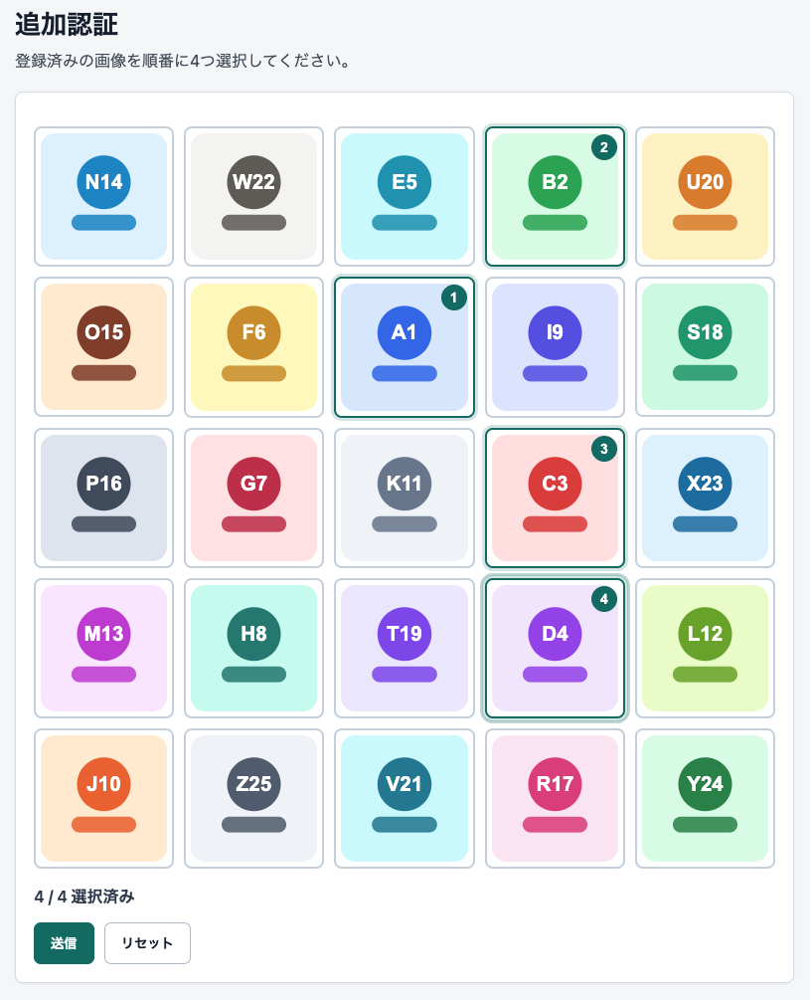
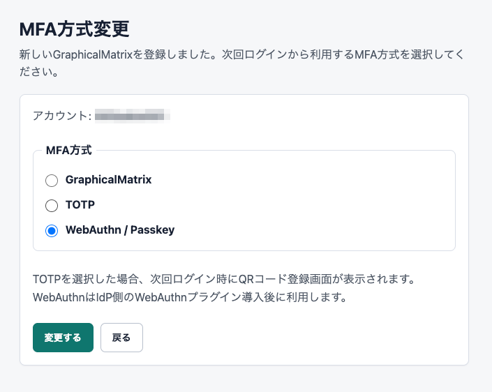
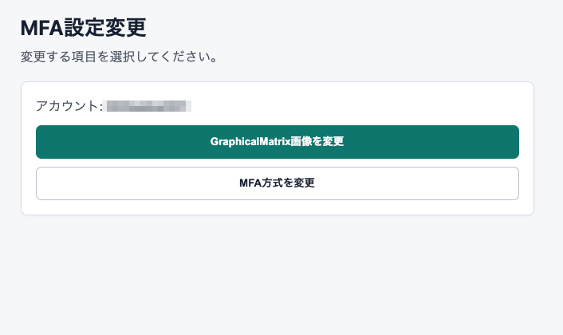

# 2FAS-KW GraphicalMatrix MFA for Shibboleth IdP plugin

About 2FAS-KW GraphicalMatrix MFA Referred to as 2FAS-KW.

2FAS-KW is a Shibboleth IdP plugin that adds an GraphicalMatrix graphical-sequence
second factor after password authentication. It can route users to one of
three MFA methods based on database settings:

- GraphicalMatrix
- TOTP
- WebAuthn

The package also includes self-service GraphicalMatrix sequence change screens,
management CLI tools, optional provisioning API endpoints, PostgreSQL-backed
storage, and example Shibboleth configuration files.

## Status

2FAS-KW is under active development. Use the latest GitHub release for
published artifacts.

## Requirements

- [Shibboleth IdP 5.2 or later](https://shibboleth.atlassian.net/wiki/spaces/IDP5/pages/3199511079)
- [Java 21](https://openjdk.org/projects/jdk/21/)
- [Jetty 12 runtime for IdP 5](https://shibboleth.atlassian.net/wiki/spaces/IDP5/pages/3516104706/Jetty12)
- [PostgreSQL](https://www.postgresql.org/docs/) for production deployments
- Optional: [Shibboleth TOTP plugin](https://shibboleth.atlassian.net/wiki/spaces/IDPPLUGINS/pages/1376878877)
- Optional: [Shibboleth WebAuthn plugin](https://shibboleth.atlassian.net/wiki/spaces/IDPPLUGINS/pages/3395321933)

H2-compatible defaults may exist for local or PoC workflows, but production
deployments should use PostgreSQL and protected sequence/TOTP seed storage.

## Supported Platforms

2FAS-KW has been tested on Rocky Linux 10.x. The Java plugin itself is not
Rocky Linux specific, but the installation documents currently assume a
RHEL-compatible environment with systemd, firewalld, dnf, and PGDG PostgreSQL
RPM paths.

Other Linux distributions may work if paths, service units, package names,
firewall commands, and PostgreSQL layout are adjusted. AlmaLinux, RHEL, and
CentOS Stream are expected to be the closest environments. Debian, Ubuntu, and
other Linux distributions are not currently tested by this project.

## Documentation

- Installation and operation: [docs/README.md](docs/README.md)
- IdP installation: [docs/INSTALL.md](docs/INSTALL.md)
- Security guide: [docs/SECURITY.md](docs/SECURITY.md)
- Security checklist: [docs/SECURITY-CHECKLIST.md](docs/SECURITY-CHECKLIST.md)
- Build from source: [docs/build.md](docs/build.md)
- Admin tools: [docs/ADMIN-TOOLS.md](docs/ADMIN-TOOLS.md)
- Configuration reference: [docs/CONFIG-REFERENCE.md](docs/CONFIG-REFERENCE.md)

## Security Defaults

The management API is intended for trusted provisioning tools only. Release
packages set it disabled by default:

```properties
graphicalmatrix.api.enabled = false
```

If the API is enabled, restrict it with HTTPS, firewall or load-balancer
rules, `graphicalmatrix.api.allowedCidrs`, and a bearer token file readable only
by the IdP runtime user.

For production, avoid plaintext GraphicalMatrix sequence storage. Use `hash`,
`keyword`, or `aes-gcm` for sequences, and use recoverable protected storage
such as `aes-gcm` or `keyword` for TOTP seeds.

## License

2FAS-KW for Shibboleth IdP is licensed under the Apache License,
Version 2.0. See `LICENSE`.

Third-party license and attribution details are listed in
`THIRD-PARTY-NOTICES.md`.

## Security Reporting

Do not open public GitHub issues for suspected vulnerabilities. Follow
`docs/SECURITY.md` for the reporting process.


## Screenshots

<p>
  
  
  
</p>

## Releases

https://github.com/y-asakawa/2faskw/releases/


## FAQ

### Is 2FAS-KW an official Shibboleth Project plugin?

No. 2FAS-KW is an independent Shibboleth IdP plugin. It is designed for
Shibboleth IdP 5, but it is not distributed by the Shibboleth Project.
We may officially release it in the near future.

### Which MFA methods are supported?

2FAS-KW can route users to GraphicalMatrix, TOTP, or WebAuthn based on database
configuration. GraphicalMatrix is provided by this plugin. TOTP and WebAuthn
require the corresponding Shibboleth IdP plugins.

### Can I use animated GIF graphical files?

Yes. The graphical servlet supports `.svg`, `.png`, `.jpg`, `.jpeg`, `.gif`, and
`.webp` files, and serves each file with the corresponding standard browser
media type. Animated GIF files should work as long as the browser supports them
and the graphical ID is listed in `graphicalmatrix.graphicals`.

### Can I use 2FAS-KW without a database?

No. The current runtime requires a JDBC database. The login, verification,
change, TOTP registration, WebAuthn routing, admin API, and CLI tools read or
write user state through the `graphicalmatrix_enrollment` table. PostgreSQL is
recommended for production deployments.

### Can I use this in production?

Production use requires careful configuration. Use PostgreSQL, avoid plaintext
sequence or seed storage, disable the management API unless required, and
restrict any enabled API with HTTPS, network controls, and bearer tokens.

### Does this plugin store secrets?

Yes. Depending on configuration, it may store GraphicalMatrix sequences and TOTP
seed material. Production deployments should use protected storage modes such
as `hash`, `keyword`, or `aes-gcm` as appropriate.

### Are locally built packages official releases?

No. Packages built from source are not official release artifacts unless they
are produced and signed by the maintainer release process. Use the latest
GitHub Release for published artifacts.

### Should security issues be reported in GitHub Issues?

No. Do not open public GitHub issues for suspected vulnerabilities. Follow
`docs/SECURITY.md` for the reporting process.
