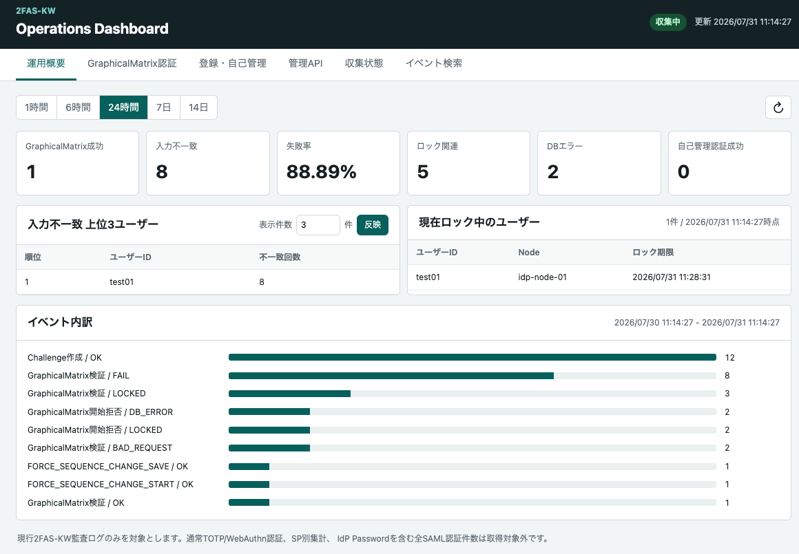

# 2FAS-KW Standalone Dashboard

2FAS-KW Dashboardは、`graphicalmatrix-audit.log`を入力とする参照専用の運用画面である。
Dashboard障害が認証処理へ影響しないよう、Shibboleth IdPおよび2FAS-KWプラグインとは別プロセスで
動作する。MFA保存DB、LDAP、IdP管理APIには接続しない。

v1.3.0ではDashboardをSP管理CLIおよびSP別LDAP属性アクセス制御とともに統合リリースとして
配布する。現在の配布・更新方針は
[`v1.3.0-RELEASE-NOTES.md`](release-notes/v1.3.0-RELEASE-NOTES.md)を参照する。
Dashboard固有の詳細設計と受入条件は、v1.2.7で確定した
[`v1.2.7-DASHBOARD.md`](release-notes/v1.2.7-DASHBOARD.md)を参照する。



## 対象範囲

現行ログから次を表示する。

- GraphicalMatrixの開始、challenge作成、検証結果、強制sequence変更。
- TOTP初回登録。
- 自己管理認証、GraphicalMatrix変更、MFA方式変更。
- 2FAS-KW管理APIの操作結果。
- Agentの最終受信、重複、parser failure、spool情報。

通常のTOTP/WebAuthn認証、SP entityID別、IdP Password認証を含むSAMLログイン全体の処理時間は
現行ログから取得できない。画面上の0件をこれらの認証が発生しなかったという意味には使用しない。

## 配置

別サーバ構成の標準形では、IdPサーバ上のAgentが監査ログをread-onlyでtailし、正規化済みイベント
だけをHTTPS+mTLSでDashboardへ送信する。既存の信頼できるsyslog基盤がある場合は、IdP別ファイルを
作成したsyslogサーバ上でAgentを動かすこともできる。DashboardからIdPやsyslogサーバへ接続する
通信経路は作らない。

小規模PoCではIdPと同じOSへ置けるが、同じJVMには組み込まず、別OSユーザー、別保存先、systemdの
resource制限を使用する。

## 必要ソフトウェア

`2faskw-dashboard.zip`にはDashboard本体、Agent、H2、Jackson、実行スクリプトを同梱している。
配布ZIPを利用する場合、Dashboard本体のためにH2、外部RDB、Tomcat、Jetty、Node.js、Python、
Grafana、Loki、Mavenを別途インストールする必要はない。

Dashboardサーバで必須となるもの:

| 項目 | 必須 | 用途 |
|---|---:|---|
| Java 21以降 | yes | Dashboard Service、import CLIの実行。 |
| bash | yes | 同梱の起動・インストールスクリプト。 |
| 展開コマンド | 導入時 | `unzip`などで配布ZIPを展開する。 |
| 専用OSユーザーと保存領域 | yes | 設定、H2索引、秘密情報の分離。 |
| PKCS#12 server key store | リアルタイム収集時 | AgentからのHTTPS受信。 |
| Agent CA trust store | リアルタイム収集時 | mTLS client certificateの検証。 |
| systemd | 推奨 | サービス起動、再起動、resource制限。手動起動も可能。 |
| 認証proxy | 本番Web UIで必須 | 管理者認証とrole headerの付与。 |

Agent稼働サーバで必須となるもの:

| 項目 | 必須 | 用途 |
|---|---:|---|
| Java 21以降 | yes | Dashboard Agentの実行。 |
| bash | yes | 同梱のAgent起動スクリプト。 |
| 監査ログのread権限 | yes | IdPまたはsyslogサーバ上のIdP別監査ログをtailする。 |
| PKCS#12 client key store | yes | DashboardへのmTLS接続。 |
| Dashboard CA trust store | yes | Dashboard server certificateの検証。 |
| DashboardへのTCP接続 | yes | 既定ではingest用TCP 9443への送信。 |

Mavenはソースからビルドする開発環境だけで必要であり、配布ZIPの実行環境では不要である。
`curl`はhealth checkに使用する運用ツールであり、Dashboard本体の実行依存ではない。

本番Web UIは認証なしで公開しない。標準例はApache HTTP ServerとShibboleth SPだが、認証済み
ユーザー名とroleを信頼済みheaderで渡せる組織標準のreverse proxyでもよい。認証proxyは配布ZIPに
含まれないため、Dashboardサーバへ別途導入・設定する。

## 別サーバ構成

現行実装はDashboardをIdPとは別のサーバで動かせる。DashboardサーバからIdP、LDAP、MFA保存DBへ
接続する必要はない。標準構成では各IdPサーバに同梱Agentを配置し、送信方向をIdPからDashboardへの
一方向にする。syslog集約構成は本書末尾の構成例を使用する。

```text
IdP server
  graphicalmatrix-audit.log
          |
          | read-only
          v
  Dashboard Agent
          |
          | HTTPS + mTLS / TCP 9443
          v
Dashboard server
  Dashboard Service + H2
          |
          | loopback / TCP 9080
          v
  Authentication reverse proxy
          |
          v
  Administrator browser
```

別サーバ運用では次を満たす必要がある。

1. DashboardサーバへJava 21と`2faskw-dashboard.zip`を導入する。
2. 各IdPサーバ、またはIdP別ログを保持するsyslogサーバへ同じZIPからAgent modeを導入する。
3. nodeごとに一意の`agent.nodeId`とclient certificateを設定する。
4. client certificateのDNS SANまたはURI SANを`agent.nodeId`と一致させる。
5. IdPサーバからDashboardのingest portへの通信だけをFirewallで許可する。
6. DashboardのUI portはloopbackで待ち受け、認証proxyに専用proxy secret headerを設定する。
7. Dashboardサーバと全IdPサーバで時刻同期を有効にする。
8. Agent停止や通信断に備え、IdP側spoolの容量と監視を設定する。

リアルタイム転送を使用できない環境でも、監査ログを安全にコピーし、オフラインimportする構成を
利用できる。この場合、Agent、ingest port、mTLS client certificateは不要だが、ログ転送自体の
完全性と機密性を別の手段で確保する。

## インストールmodeと導入範囲

署名とchecksumを検証してZIPを展開する。インストーラーの`--mode`は必須で、次の2種類がある。

| mode | 用途 | 既定prefix | 設定 | state |
|---|---|---|---|---|
| `server` | Dashboard Serviceとimport CLI | `/opt/2faskw-dashboard` | `/etc/2faskw-dashboard` | `/var/lib/2faskw-dashboard` |
| `agent` | 監査ログ転送Agent | `/opt/2faskw-dashboard-agent` | `/etc/2faskw-dashboard-agent` | `/var/lib/2faskw-dashboard-agent` |

`--mode both`はない。同じサーバで両方を動かす場合は、`server`と`agent`をそれぞれ別prefixで
実行する。

構成ごとに必要なmodeは次のとおりである。

| 構成 | Dashboardサーバ | IdPまたはsyslogサーバ |
|---|---|---|
| 別サーバ・リアルタイム収集 | `server` | `agent` |
| オフラインimportのみ | `server` | インストール不要 |
| 同一OS上のPoC | `server` | 同じOSへ別prefixで`agent` |

配布JARと`lib/`は共通であり、Dashboard、Agent、importのコードを含む。modeはJARから不要なclassを
削除する機能ではなく、OSユーザー、設定ファイル、保存先、実際に起動するサービスを分離する機能で
ある。`agent` modeでDashboard Serviceが起動したり、`server` modeでAgentが起動したりすることは
ない。

### dry-run

`--apply`を付けない場合は、予定するmode、prefix、設定、stateを表示するだけでファイルを変更しない。

Dashboardのみ:

```bash
sudo ./bin/2faskw-dashboard-install.sh \
  --mode server \
  --prefix /opt/2faskw-dashboard
```

Agentのみ:

```bash
sudo ./bin/2faskw-dashboard-install.sh \
  --mode agent \
  --prefix /opt/2faskw-dashboard-agent
```

### インストールの反映

確認後、反映する場合だけ`--apply`を追加する。`--apply`はroot権限が必要である。

Dashboardのみ:

```bash
sudo ./bin/2faskw-dashboard-install.sh \
  --mode server \
  --prefix /opt/2faskw-dashboard \
  --apply
```

Agentのみ:

```bash
sudo ./bin/2faskw-dashboard-install.sh \
  --mode agent \
  --prefix /opt/2faskw-dashboard-agent \
  --apply
```

インストーラーの動作は次のとおりである。

- modeに対応する専用OSユーザーが存在しなければ`useradd`で作成する。
- `<prefix>/bin`へ全起動スクリプト、`<prefix>/lib`へ共通JARと依存JARを配置する。
- modeに対応する設定ディレクトリ、`credentials/`、stateディレクトリを作成する。
- 初回だけ`dashboard.properties`または`agent.properties`を設定例から作成する。
- `server` modeでは初回だけ`roles.properties`を作成する。
- 初回だけ`reason-mapping.properties`を作成する。
- 既存のpropertiesファイルは上書きしない。
- `bin/`と`lib/`は再実行時に同名ファイルを更新するが、旧versionだけに存在するファイルは削除しない。

`--prefix`で変更されるのは`bin/`と`lib/`の配置先である。`/etc/2faskw-dashboard*`と
`/var/lib/2faskw-dashboard*`は変更されない。これらも変更する場合は、インストール後に設定と
systemd unitを一貫して変更する。

インストーラーは次を実行しない。

- PKCS#12 key store、trust store、password file、HMAC鍵の生成。
- Apache HTTP Server、Shibboleth SP、Javaのインストール。
- systemd unitのコピー、`daemon-reload`、enable、start。
- Firewall、SELinux、logrotate、syslogの設定。

したがって`--apply`完了だけでは起動可能とは限らない。設定、credential、ファイル権限、
認証proxy、Firewallを確認し、`check`成功後に対象サービスだけを登録・起動する。

### 再インストールと更新時の注意

同じmodeとprefixへ再実行すると同名のJARとスクリプトは更新されるが、既存propertiesは保持される。
インストーラーは旧versionだけに存在する依存JARやスクリプトを自動削除しないため、単純な再実行を
完全なアップグレード手順として扱わない。

新版で設定項目が追加された場合は、展開したZIPの`conf/*.example`と既存設定を比較し、必要な項目を
手動で反映する。依存JAR構成が変わる更新では、新しい空のprefixへ導入してsystemd unitを切り替えるか、
停止中に旧prefixと新パッケージのmanifestを比較して不要ファイルを除去する。設定を削除して再作成する
方法は、秘密情報や運用値を失うため使用しない。

更新前には設定、credential、H2、Agent state、spoolを必要に応じてバックアップする。Dashboardと
Agentを別サーバへ導入している場合は、それぞれのサーバで同じversionへ更新する。

### バージョンアップ

バージョンアップはサービスを停止後、ファイルを上書きして起動させる。

```
sudo systemctl stop 2faskw-dashboard-agent.service
sudo systemctl stop 2faskw-dashboard.service
sudo ./bin/2faskw-dashboard-install.sh \
  --mode server \
  --prefix /opt/2faskw-dashboard \
  --apply
sudo ./bin/2faskw-dashboard-install.sh \
  --mode agent \
  --prefix /opt/2faskw-dashboard-agent \
  --apply
sudo systemctl start 2faskw-dashboard.service
sudo systemctl start 2faskw-dashboard-agent.service
```

### 更新後の再起動と収集確認

JARと設定ファイルの更新後は、稼働中のJavaプロセスが旧JARを保持しないよう、Dashboard本体を先に
再起動し、受信ポートを確認してからAgentを再起動する。

```bash
sudo systemctl restart 2faskw-dashboard.service
sudo systemctl is-active 2faskw-dashboard.service
sudo ss -lntp | grep -E ':9080|:9443'

sudo systemctl restart 2faskw-dashboard-agent.service
sudo systemctl is-active 2faskw-dashboard-agent.service
sudo journalctl -u 2faskw-dashboard-agent.service -n 50 --no-pager
```

`9443`が待受状態であり、Agentのjournalに継続する`ConnectException`またはTLSエラーがないことを
確認する。Dashboard画面の「収集遅延」は、Agentのheartbeat間隔（既定60秒）以内に解消することを
確認する。serverとagentを別サーバへ導入している場合は、Dashboardサーバで前半3行、Agentサーバで
後半3行を実行する。

## Dashboard設定

`/etc/2faskw-dashboard/dashboard.properties`を編集する。配布時の
`dashboard.enabled=false`は、認証mode、保存先、mTLSを確認した後に`true`へ変更する。

```properties
dashboard.enabled = true
dashboard.http.bindAddress = 127.0.0.1
dashboard.http.port = 9080
dashboard.auth.mode = proxy
dashboard.auth.trustedProxies = 127.0.0.1/32,::1/128
dashboard.auth.proxySecretHeader = X-2FASKW-Proxy-Secret
dashboard.auth.proxySecretFile = /etc/2faskw-dashboard/credentials/proxy.secret
dashboard.storage.retentionDays = 30
dashboard.storage.aggregateRetentionDays = 90
dashboard.query.maxRangeDays = 100
```

`auth.mode=none`はloopback bindでだけ利用できる。運用環境ではApache HTTP Serverと
Shibboleth SPなどの認証proxyを使用するか、閉じた管理ネットワーク内に限定して`local` modeを
使用する。

ingestはUIと別のTLS portを使用する。PKCS#12 key store、trust storeと、それぞれのpassword fileを
指定する。passwordはpropertiesへ直接記載しない。

Agent client certificateはnodeごとに発行し、DNS SANを`agent.nodeId`と一致させる。またはURI SANを
`urn:2faskw:node:<nodeId>`形式にする。

監査ログを手動でコピーしてオフラインimportだけを行い、Agentからリアルタイム受信しない場合は
次を設定する。この場合、Dashboardのingest用key storeとtrust storeは不要である。

```properties
dashboard.ingest.enabled = false
```

`ingest.enabled=false`でもWeb UIとオフラインimportは利用できる。

## 認証modeとrole

利用できる認証modeは次の3種類である。

| mode | 用途 | 接続元制限 | 最大role |
|---|---|---|---|
| `none` | Dashboardサーバ自身またはSSH tunnelによるPoC | loopbackのみ | `DASHBOARD_ADMIN` |
| `local` | 閉じた管理LANからの簡易閲覧 | `localAllowedCIDRs` | `DASHBOARD_OPERATOR` |
| `proxy` | 本番運用 | `trustedProxies` | `DASHBOARD_ADMIN` |

### local mode

認証proxyを構築せず、Dashboardサーバと同じ管理ネットワークにあるPCから参照する場合は
`local` modeを使用できる。次の例ではDashboardサーバの管理LAN addressを`192.168.10.20`、
閲覧を許可するネットワークを`192.168.10.0/24`としている。

```properties
dashboard.enabled = true
dashboard.http.bindAddress = 192.168.10.20
dashboard.http.port = 9080
dashboard.http.basePath = /2faskw-dashboard

dashboard.auth.mode = local
dashboard.auth.localAllowedCIDRs = 192.168.10.0/24
dashboard.auth.localRole = DASHBOARD_VIEWER
```

設定後にDashboardを再起動し、許可ネットワーク内のPCから次へアクセスする。

```text
http://192.168.10.20:9080/2faskw-dashboard/
```

複数ネットワークはcomma区切りで指定する。単一端末だけを許可する場合はIPv4を`/32`、IPv6を
`/128`で指定する。

```properties
dashboard.auth.localAllowedCIDRs = 192.168.10.0/24,10.20.0.15/32,2001:db8:100::/48
```

`localAllowedCIDRs`は必須である。空設定、hostname、`0.0.0.0/0`、`::/0`、不正CIDRは起動時に
拒否される。`dashboard.http.bindAddress`にはDashboardサーバの具体的なinterface addressを指定し、
`0.0.0.0`と`::`は使用できない。

Dashboardは`Forwarded`、`X-Forwarded-For`、`X-Real-IP`を信用せず、実際のTCP接続元IPだけで
判定する。許可CIDR外からのHTML、JavaScript、CSS、API、health要求はHTTP 403になる。
OS Firewallでも同じネットワークだけからTCP 9080を許可する。

`localRole`の既定値は`DASHBOARD_VIEWER`で、次の2値だけを指定できる。

```text
DASHBOARD_VIEWER
DASHBOARD_OPERATOR
```

`DASHBOARD_AUDITOR`と`DASHBOARD_ADMIN`は、利用者単位で認証できる`proxy` modeだけで使用する。
`local` modeでは全接続者が固定利用者`local-network`として監査され、個人を識別できない。

v1.2.7のDashboard UI listenerはTLSを直接提供しない。`local` modeは専用管理VLANまたはVPNなど、
平文HTTPを許容できる閉じたネットワークだけで使用する。HTTPS、利用者識別、個人単位の監査が
必要な場合は`proxy` modeを使用する。

### proxy mode

`dashboard.auth.mode=proxy`では、Dashboardは接続元が`trustedProxies`に一致し、さらに
`proxySecretHeader`が`proxySecretFile`の値と一致する場合だけ`remoteUserHeader`と`roleHeader`を
信頼する。loopback上の別processがidentity headerを直接送信しても、proxy secretがなければ拒否される。
認証proxyは外部クライアントから同名headerを受け取らず、必ず削除してから認証結果で設定する。

同梱のApache HTTP Server例では次を使用する。

```text
X-Remote-User
X-2FASKW-Role
X-2FASKW-Proxy-Secret
```

server modeのインストーラーは
`/etc/2faskw-dashboard/credentials/proxy.secret`へ64桁のrandom hex値を生成する。同梱Apache例を
`/etc/httpd/conf.d/`などへroot所有かつ`0600`で配置し、rootだけが利用できるeditorで
`REPLACE_WITH_PROXY_SECRET`を同じ値へ置換する。secretをshellのcommand lineへ展開せず、Apache access
logにもこのheaderを追加しない。proxy secretを変更した場合はApacheとDashboardの両方を再起動する。

利用できるroleは次のとおりである。

| role | 利用範囲 |
|---|---|
| `DASHBOARD_VIEWER` | 概要、GraphicalMatrix、自己管理の参照。 |
| `DASHBOARD_OPERATOR` | VIEWERに加えて、node収集状態とイベント検索。 |
| `DASHBOARD_AUDITOR` | OPERATORに加えて、管理API操作履歴と有効時のCSV export。 |
| `DASHBOARD_ADMIN` | 現行の全参照API。DashboardからIdPを変更する機能はない。 |

VIEWERとOPERATORが参照できるイベントは、認証イベントと自己管理イベントの明示的な
allowlistに限定される。`/api/v1/events`で管理イベントを完全一致または正規表現指定しても、
`API_`イベントと未分類イベントは返らない。AUDITORとADMINだけが管理イベントを含む全イベントを
参照できる。閲覧範囲は認証済みPrincipalから決定され、query parameterでは拡張できない。

`/etc/2faskw-dashboard/roles.properties`では、認証済みユーザーをroleへ固定できる。

```properties
dashboard-operator = DASHBOARD_OPERATOR
security-auditor = DASHBOARD_AUDITOR
```

ユーザーが`roles.properties`に存在する場合、その設定が`roleHeader`より優先される。存在しない場合は
認証proxyが渡した`roleHeader`を使用する。roleを変更した場合はDashboardを再起動する。

`dashboard.auth.mode=none`はloopback bindでだけ使用でき、接続者を
`DASHBOARD_ADMIN`として扱う。これはローカル検証用であり、本番運用では使用しない。

## mTLS credential

インストーラーは証明書やkey storeを生成しない。組織のCA運用に従って次を用意する。

Dashboardサーバ:

```text
/etc/2faskw-dashboard/credentials/dashboard-server.p12
/etc/2faskw-dashboard/credentials/dashboard-server.password
/etc/2faskw-dashboard/credentials/dashboard-agent-ca.p12
/etc/2faskw-dashboard/credentials/dashboard-agent-ca.password
```

各Agent:

```text
/etc/2faskw-dashboard-agent/credentials/<nodeId>.p12
/etc/2faskw-dashboard-agent/credentials/<nodeId>.password
/etc/2faskw-dashboard-agent/credentials/dashboard-ca.p12
/etc/2faskw-dashboard-agent/credentials/dashboard-ca.password
```

key storeとtrust storeはPKCS#12形式とする。password fileはUTF-8の空でない1行だけとし、
propertiesへpasswordを直接記載しない。改行で区切った複数行は受け付けない。

credentialは対象サービスの専用OSユーザーだけが読み取れるようにする。秘密鍵を配布ZIP、Git、
GitHub Release、監査ログへ置かない。

### PoC用自己署名CAでの作成例

以下は閉じたPoC環境だけを対象とする。server証明書とAgent証明書を個別に自己署名するのではなく、
PoC専用の自己署名CAを1つ作成し、そのCAからserverAuthとclientAuthのleaf証明書を発行する。本番では
組織のCA、証明書失効、更新、秘密鍵保管の運用へ置き換える。

例ではDashboard名に`dashboard-poc.example.test`、Dashboard IPに文書用アドレス`192.0.2.10`、
Agentの`nodeId`に`idp-node-01`を使用する。実環境の値へ置き換える。`agent.dashboardUrl`でDNS名を
使う場合はserver証明書のDNS SAN、IPアドレスを使う場合はIP SANと完全に一致させる。

次の作業はroot用の一時ディレクトリで行う。最初にroot shellへ入り、umaskを設定する。

```bash
sudo -i

umask 077
WORK=/root/2faskw-dashboard-poc-ca
SERVER_DNS=dashboard-poc.example.test
DASHBOARD_IP=192.0.2.10
NODE_ID=idp-node-01

install -d -m 0700 "$WORK"
cd "$WORK"
```

PoC CAの秘密鍵と自己署名CA証明書を作成する。

```bash
openssl genpkey \
  -algorithm RSA \
  -pkeyopt rsa_keygen_bits:4096 \
  -out dashboard-poc-ca.key

openssl req \
  -x509 \
  -new \
  -sha256 \
  -days 3650 \
  -key dashboard-poc-ca.key \
  -subj '/CN=2FAS-KW Dashboard PoC CA' \
  -addext 'basicConstraints=critical,CA:TRUE,pathlen:0' \
  -addext 'keyUsage=critical,keyCertSign,cRLSign' \
  -addext 'subjectKeyIdentifier=hash' \
  -out dashboard-poc-ca.crt
```

Dashboard server用の秘密鍵、CSR、serverAuth証明書を作成する。DNS名とIPアドレスのうち、実際に
Agentの接続URLで使用する値をSANへ必ず含める。

```bash
openssl genpkey \
  -algorithm RSA \
  -pkeyopt rsa_keygen_bits:3072 \
  -out dashboard-server.key

openssl req \
  -new \
  -sha256 \
  -key dashboard-server.key \
  -subj "/CN=${SERVER_DNS}" \
  -out dashboard-server.csr

cat > dashboard-server.ext <<EOF
basicConstraints=critical,CA:FALSE
keyUsage=critical,digitalSignature,keyEncipherment
extendedKeyUsage=serverAuth
subjectAltName=DNS:${SERVER_DNS},IP:${DASHBOARD_IP}
subjectKeyIdentifier=hash
authorityKeyIdentifier=keyid,issuer
EOF

openssl x509 \
  -req \
  -sha256 \
  -days 365 \
  -in dashboard-server.csr \
  -CA dashboard-poc-ca.crt \
  -CAkey dashboard-poc-ca.key \
  -CAcreateserial \
  -extfile dashboard-server.ext \
  -out dashboard-server.crt
```

Agent用の秘密鍵、CSR、clientAuth証明書を作成する。DNS SANまたは
`URI:urn:2faskw:node:<nodeId>`から得られる値が`agent.nodeId`と一致しなければ、Dashboardはbatchを
拒否する。複数Agentでは`NODE_ID`を変更し、Agentごとに異なる証明書を発行する。

```bash
openssl genpkey \
  -algorithm RSA \
  -pkeyopt rsa_keygen_bits:3072 \
  -out "${NODE_ID}.key"

openssl req \
  -new \
  -sha256 \
  -key "${NODE_ID}.key" \
  -subj "/CN=${NODE_ID}" \
  -out "${NODE_ID}.csr"

cat > "${NODE_ID}.ext" <<EOF
basicConstraints=critical,CA:FALSE
keyUsage=critical,digitalSignature,keyEncipherment
extendedKeyUsage=clientAuth
subjectAltName=DNS:${NODE_ID},URI:urn:2faskw:node:${NODE_ID}
subjectKeyIdentifier=hash
authorityKeyIdentifier=keyid,issuer
EOF

openssl x509 \
  -req \
  -sha256 \
  -days 365 \
  -in "${NODE_ID}.csr" \
  -CA dashboard-poc-ca.crt \
  -CAkey dashboard-poc-ca.key \
  -CAcreateserial \
  -extfile "${NODE_ID}.ext" \
  -out "${NODE_ID}.crt"
```

key storeとtrust storeごとにランダムpassword fileを作り、PKCS#12へ変換する。

```bash
openssl rand -base64 36 > dashboard-server.password
openssl rand -base64 36 > dashboard-agent-ca.password
openssl rand -base64 36 > "${NODE_ID}.password"
openssl rand -base64 36 > dashboard-ca.password

openssl pkcs12 \
  -export \
  -name dashboard-server \
  -inkey dashboard-server.key \
  -in dashboard-server.crt \
  -certfile dashboard-poc-ca.crt \
  -out dashboard-server.p12 \
  -passout file:dashboard-server.password

openssl pkcs12 \
  -export \
  -name "$NODE_ID" \
  -inkey "${NODE_ID}.key" \
  -in "${NODE_ID}.crt" \
  -certfile dashboard-poc-ca.crt \
  -out "${NODE_ID}.p12" \
  -passout "file:${NODE_ID}.password"

keytool -importcert -noprompt \
  -alias dashboard-agent-poc-ca \
  -file dashboard-poc-ca.crt \
  -storetype PKCS12 \
  -keystore dashboard-agent-ca.p12 \
  -storepass:file dashboard-agent-ca.password

keytool -importcert -noprompt \
  -alias dashboard-server-poc-ca \
  -file dashboard-poc-ca.crt \
  -storetype PKCS12 \
  -keystore dashboard-ca.p12 \
  -storepass:file dashboard-ca.password
```

発行内容と署名を確認する。

```bash
openssl verify \
  -CAfile dashboard-poc-ca.crt \
  dashboard-server.crt \
  "${NODE_ID}.crt"

openssl x509 \
  -in dashboard-server.crt \
  -noout \
  -subject \
  -issuer \
  -dates \
  -ext subjectAltName,extendedKeyUsage

openssl x509 \
  -in "${NODE_ID}.crt" \
  -noout \
  -subject \
  -issuer \
  -dates \
  -ext subjectAltName,extendedKeyUsage
```

作成したPKCS#12とpassword fileだけを各サービスのcredentialディレクトリへ配置する。

```bash
install -o 2faskw-dashboard -g 2faskw-dashboard -m 0600 \
  dashboard-server.p12 \
  /etc/2faskw-dashboard/credentials/dashboard-server.p12
install -o 2faskw-dashboard -g 2faskw-dashboard -m 0600 \
  dashboard-server.password \
  /etc/2faskw-dashboard/credentials/dashboard-server.password
install -o 2faskw-dashboard -g 2faskw-dashboard -m 0600 \
  dashboard-agent-ca.p12 \
  /etc/2faskw-dashboard/credentials/dashboard-agent-ca.p12
install -o 2faskw-dashboard -g 2faskw-dashboard -m 0600 \
  dashboard-agent-ca.password \
  /etc/2faskw-dashboard/credentials/dashboard-agent-ca.password

install -o 2faskw-dashboard-agent -g 2faskw-dashboard-agent -m 0600 \
  "${NODE_ID}.p12" \
  "/etc/2faskw-dashboard-agent/credentials/${NODE_ID}.p12"
install -o 2faskw-dashboard-agent -g 2faskw-dashboard-agent -m 0600 \
  "${NODE_ID}.password" \
  "/etc/2faskw-dashboard-agent/credentials/${NODE_ID}.password"
install -o 2faskw-dashboard-agent -g 2faskw-dashboard-agent -m 0600 \
  dashboard-ca.p12 \
  /etc/2faskw-dashboard-agent/credentials/dashboard-ca.p12
install -o 2faskw-dashboard-agent -g 2faskw-dashboard-agent -m 0600 \
  dashboard-ca.password \
  /etc/2faskw-dashboard-agent/credentials/dashboard-ca.password
```

同一ホストのPoCでDNS SANを使用する場合は、名前解決を用意してAgentのURLも同じDNS名にする。

```text
127.0.0.1 dashboard-poc.example.test
```

```properties
agent.nodeId = idp-node-01
agent.dashboardUrl = https://dashboard-poc.example.test:9443/2faskw-dashboard/ingest/v1/events
agent.tls.keyStore = /etc/2faskw-dashboard-agent/credentials/idp-node-01.p12
agent.tls.keyStorePasswordFile = /etc/2faskw-dashboard-agent/credentials/idp-node-01.password
agent.tls.trustStore = /etc/2faskw-dashboard-agent/credentials/dashboard-ca.p12
agent.tls.trustStorePasswordFile = /etc/2faskw-dashboard-agent/credentials/dashboard-ca.password
```

作業後はroot shellを終了する。`dashboard-poc-ca.key`、leaf秘密鍵、CSR、作業用password fileを
Git、配布ZIP、Dashboardサーバの公開領域へ置かない。PoC CA秘密鍵を再発行用に残す場合は、
暗号化されたオフライン領域へ移し、作業ディレクトリをroot以外から読めない状態に保つ。

## Agent設定

`/etc/2faskw-dashboard-agent/agent.properties`へ、OS hostnameではなく運用上のopaqueなnode IDを
明示する。

```properties
agent.enabled = true
agent.nodeId = idp-node-01
agent.source = /opt/shibboleth-idp/logs/graphicalmatrix-audit.log
agent.dashboardUrl = https://dashboard.example.org:9443/2faskw-dashboard/ingest/v1/events
agent.heartbeatSeconds = 60
agent.privacy.userMode = plain
agent.privacy.ipMode = plain
```

既定の`userMode=plain`では、運用上「誰が認証したか」を確認できるようユーザーIDをmTLSで送信し、
Dashboardへ保存する。既定の`ipMode=plain`では、監査ログの送信元IPアドレスもmTLSで送信し、
イベント一覧、検索、TOP集計に使用する。IPをネットワーク単位へ縮約する場合は`prefix`、
送信しない場合は`drop`へ変更できる。`prefix`はIPv4を`/24`、IPv6を`/48`として保存する。
session、challenge、raw detailは送信しない。

ユーザーIDを仮名化する場合は`hmac`、送信しない場合は`drop`へ変更できる。`hmac`を使う場合は
Dashboard専用の32 bytes以上のランダム鍵を用意し、sequence、TOTP、DB、API tokenの鍵を再利用しない。

`plain`で扱うユーザーIDは`[A-Za-z0-9._@-]{1,255}`に限定する。Dashboardのイベント一覧には
ユーザーIDを表示し、イベント検索画面では完全一致または正規表現で絞り込める。ユーザーIDは
個人情報として、Dashboardの認証・認可、H2ファイルとbackupの権限、保持期間を定める。送信元IPも
同様に個人または端末を識別し得る運用情報として扱う。

設定変更後に新しく取り込むイベントだけが新しいmodeの対象になる。すでに保存済みのイベントへ
ユーザーIDやIPアドレスを遡って付与したり、HMAC値やIP prefixを生の値へ変換したりはしない。
過去分にもIPアドレスが必要な場合は、保持中の元監査ログを`plain` modeで再取り込みする。

Agentは送信不能時に上限付きspoolへ保存する。spoolが上限へ達した場合は古いbatchを削除するが、
IdP認証を停止しない。

認証イベントが発生しない時間帯も、Agentは`heartbeatSeconds`間隔で空のheartbeatを送信する。
heartbeatはイベント件数を増やさず、Nodeの最終受信時刻、Agentバージョン、spool容量だけを更新する。
画面の「収集遅延」は最終イベント時刻ではなく、この最終受信時刻が
`dashboard.health.staleEventSeconds`を超えた場合に表示される。
オフラインimportで作成されたNodeはheartbeatを持たないためリアルタイム判定から除外し、
「オフライン」と表示する。リアルタイムAgentが1台もない場合の全体表示は「オフライン取込」とする。

Agent用OSユーザーには監査ログだけを読み取れる権限を与える。IdPのcredential、設定ファイル、
MFA保存DBへの読取り権限は与えない。配布ZIPのsystemd例は
`/opt/shibboleth-idp/logs`をread-onlyとし、logrotate後の新しい監査ログも追跡できるようにしている。

## 複数Agentの集約動作

複数Agentは同じDashboardへ送信できる。Agentごとに一意な`agent.nodeId`を設定し、state、spool、
client certificateを共有しない。

現在の画面動作は次のとおりである。

- 概要の成功数、失敗数、失敗率、event別件数は全nodeの合計である。
- GraphicalMatrix、自己管理、管理APIのevent一覧は複数nodeを同じ表へ表示し、`Node`列で区別する。
- 収集状態はnodeごとに最終受信、最終event、accepted、duplicate、parser failure、spoolを表示する。
- イベント検索は項目プルダウンで`node`、event、result、reason、ユーザーID、IPアドレスを選択し、
  隣の自由入力欄へ検索値を指定する。完全一致と正規表現を切り替えられる。
- 現行の概要カードにはnode別統計への切替機能はない。
- Agentは認証イベントがなくてもheartbeatを送信し、nodeごとの最終受信時刻を更新する。
- 画面上部の全体収集バッジは、全リアルタイムnodeが期限内の場合だけ「収集中」とする。
- リアルタイムnodeのうち1台でも`dashboard.health.staleEventSeconds`を超えた場合は「収集遅延」とする。
- `offline-import`のnodeはリアルタイム判定から除外し、Agentが1台もなければ「オフライン取込」とする。

同じ`nodeId`を複数Agentへ設定すると収集状態が混在し、重複排除にも影響するため使用しない。

## 起動前検査

実際のサービスと同じOSユーザーで検査する。これにより、設定、監査ログ、credential、保存先の
基本的な読取り・書込み権限も確認できる。

Dashboardサーバ:

```bash
sudo -u 2faskw-dashboard \
  /opt/2faskw-dashboard/bin/2faskw-dashboard.sh check
```

Agent稼働サーバ:

```bash
sudo -u 2faskw-dashboard-agent \
  /opt/2faskw-dashboard-agent/bin/2faskw-dashboard-agent.sh check
```

`check`は設定値、Java version、ローカルファイルの基本条件を検査する。DashboardとAgent間の
ネットワーク到達性、mTLS handshake、認証proxyのログインまでは確認しない。検査後に同梱の
systemd例を確認し、OSに合わせて配置する。

## systemdへの登録

Dashboardサーバでは、展開したパッケージのルートディレクトリで次を実行する。

```bash
sudo install -m 0644 \
  examples/systemd/2faskw-dashboard.service \
  /etc/systemd/system/2faskw-dashboard.service

sudo systemctl daemon-reload
sudo systemctl enable 2faskw-dashboard.service
```

IdPへAgentを直接置く標準構成では、各IdPサーバにAgent用unitを登録する。syslogサーバで複数Agentを
動かす場合は、本書末尾のsystemd templateを使用する。

```bash
sudo install -m 0644 \
  examples/systemd/2faskw-dashboard-agent.service \
  /etc/systemd/system/2faskw-dashboard-agent.service

sudo systemctl daemon-reload
sudo systemctl enable 2faskw-dashboard-agent.service
```

同梱例は、Dashboardを`2faskw-dashboard`、Agentを`2faskw-dashboard-agent`という専用OSユーザーで
動かす。インストール先、OSユーザー、メモリ上限などを変更した場合はunitも一致させる。

## 起動と状態確認

最初にDashboard Serviceを起動し、readinessを確認してから各Agent稼働サーバのAgentを起動する。

Dashboardサーバ:

```bash
sudo systemctl start 2faskw-dashboard.service
sudo systemctl status 2faskw-dashboard.service --no-pager

curl -fsS \
  http://127.0.0.1:9080/2faskw-dashboard/health/live
curl -fsS \
  http://127.0.0.1:9080/2faskw-dashboard/health/ready
```

`live`と`ready`がともにHTTP 200を返した後、IdPまたはsyslogサーバでAgentを起動する。

```bash
sudo systemctl start 2faskw-dashboard-agent.service
sudo systemctl status 2faskw-dashboard-agent.service --no-pager
```

`proxy` modeのWeb UIは認証proxy経由のURLへアクセスして確認する。`9080`の直接portは
loopback専用であり、外部クライアントへ公開しない。`local` modeでは、許可CIDR内のPCから
`http://<dashboard.http.bindAddress>:9080/2faskw-dashboard/`へアクセスする。収集状態画面では、
各nodeの最終受信時刻、parser failure、clock skew、spool bytesを確認する。
Agent起動直後に最初のheartbeatが送信され、以後は`agent.heartbeatSeconds`間隔で最終受信時刻が
更新される。画面は60秒間隔で自動更新するため、手動更新を使わない場合でも通常は
`heartbeatSeconds + 60`秒以内に「収集中」へ変わる。

「収集遅延」が継続する場合は、DashboardとAgentの両方をheartbeat対応版へ更新した上で確認する。
新Agentだけを旧Dashboardへ接続すると、空のheartbeat batchがHTTP 400で拒否される。

```bash
sudo -u 2faskw-dashboard-agent \
  /opt/2faskw-dashboard-agent/bin/2faskw-dashboard-agent.sh check

sudo journalctl \
  -u 2faskw-dashboard-agent.service \
  -n 100 \
  --no-pager
```

`check`の`heartbeat_seconds`、Agent journalのHTTP、mTLS、再試行エラーを確認する。

## TOPページの統計とイベント検索

TOPページには、選択期間内のGraphicalMatrix成功数、入力不一致数、失敗率などに加えて、次を表示する。

- 入力不一致の上位ユーザーID。`event=VERIFY AND result=FAIL`をユーザーID別に集計する。
- 送信元IPの認証試行上位。`event=VERIFY AND result IN (OK, FAIL, LOCKED)`をIPアドレス別に集計する。
- 送信元IPの入力不一致上位。`event=VERIFY AND result=FAIL`をIPアドレス別に集計する。
- 現在ロック中と推定したユーザーID、最後にロックを記録したnode、ロック期限。

入力不一致ユーザーランキングと2種類の送信元IPランキングは、既定で上位3件を表示する。
「表示件数」へ1～100を入力して「反映」を押すと表示件数を変更できる。送信元IPの表示件数は
認証試行と入力不一致の両方へ共通して適用する。値は画面上部で選択した期間に連動し、ブラウザを
再読み込みすると既定の3件へ戻る。APIを直接使用する場合は
`GET /api/v1/summary?topMismatchLimit=<1-100>&topSourceNetworkLimit=<1-100>`で指定する。

ユーザーIDが`drop`で保存されたイベントはランキング対象外になる。`hmac`の場合は生の
ユーザーIDではなくHMAC値を表示する。

IPアドレスが`drop`で保存されたイベントは送信元IPランキングの対象外になる。`prefix`の場合は
個別IPではなくIPv4 `/24`またはIPv6 `/48`ネットワーク単位のランキングになる。

画面上部の「カスタム」を選択すると、ブラウザのローカル時刻で開始日時と終了日時を分単位で
指定できる。適用後は固定した`from`と`to`を全画面の統計とイベント一覧へ使用し、自動更新でも
期間を移動しない。画面にはブラウザが使用しているタイムゾーンを表示する。開始日時は集計対象に
含み、終了日時は含まない。指定可能な最大期間は`dashboard.query.maxRangeDays`（既定・最大100日）
である。

現在ロック中の一覧はAUDITORまたはADMINでだけ表示する。VIEWERとOPERATORではロック件数を`0`と
表示せず、権限上利用できないことを表示する。APIの`lockedUserCount`と`lockedUsersAsOf`は`null`、
`lockedUsers`は空配列となり、`visibility.lockedUsersAvailable=false`で判別できる。

AUDITORまたはADMINでは、現在ロック中の一覧を選択期間ではなく、保持中の監査ログ全体から最新の状態遷移を評価する。
`LOCKED`イベントから抽出した`locked_until`が現在時刻より後であり、その後に認証成功または管理APIの
unlock・RESET・MFA方式変更が記録されていないユーザーを表示する。画面へ表示する一覧は100件までで、
総件数は別に表示する。

このロック状態は監査ログからの推定値であり、管理CLI、CSV処理、直接SQL・LDAP変更など、監査ログへ
記録されない解除操作は直ちに反映されない。正確な状態の最終確認はMFA保存DBまたはLDAPで行う。
旧Dashboardで取り込んだイベントには`locked_until`がないため、過去分も判定する場合は本書の
「ログの再取り込みと索引の再構築」を実施する。

イベント検索は既定で大文字小文字を区別した完全一致である。「正規表現（RE2、大小区別）」を有効に
すると、Node、Event、Result、Reason、ユーザーID、IPアドレスの入力をRE2正規表現として扱う。正規表現は
128文字以内とし、指定したすべての条件に一致するイベントだけを返す。部分一致が既定なので完全一致
にする場合は`^`と`$`を付ける。

例:

```text
^loadtest[0-9]{4}$
^(VERIFY|START)$
^(FAIL|LOCKED)$
^192\.0\.2\.[0-9]+$
```

RE2はbackreferenceとlookaroundをサポートしない。正規表現検索は通常の完全一致より多くのイベントを
走査するため、必要な期間と条件へ絞り、繰り返し自動実行しない。

## 終了と再起動

全体を停止する場合は、未送信イベントを増やさないようAgentを先に停止し、次にDashboardを停止する。

IdPサーバ:

```bash
sudo systemctl stop 2faskw-dashboard-agent.service
```

Dashboardサーバ:

```bash
sudo systemctl stop 2faskw-dashboard.service
```

設定ファイルにhot reload機能はない。設定変更後は、対象サービスの`check`を実行してから再起動する。

```bash
sudo -u 2faskw-dashboard \
  /opt/2faskw-dashboard/bin/2faskw-dashboard.sh check
sudo systemctl restart 2faskw-dashboard.service
```

```bash
sudo -u 2faskw-dashboard-agent \
  /opt/2faskw-dashboard-agent/bin/2faskw-dashboard-agent.sh check
sudo systemctl restart 2faskw-dashboard-agent.service
```

Dashboardだけを再起動している間、Agentは送信できないbatchをspoolへ保存する。短時間の再起動であれば
Agent停止は必須ではない。計画停止や証明書更新では、Agentを先に停止する。

## ログ確認

同梱のsystemd例は標準出力と標準エラーをsystemd journalへ記録する。

Dashboardサーバ:

```bash
sudo journalctl -u 2faskw-dashboard.service -n 200 --no-pager
sudo journalctl -u 2faskw-dashboard.service -f
```

IdPサーバ:

```bash
sudo journalctl -u 2faskw-dashboard-agent.service -n 200 --no-pager
sudo journalctl -u 2faskw-dashboard-agent.service -f
```

IdPへ直接配置する場合、Agentが読み取る既定ログは
`/opt/shibboleth-idp/logs/graphicalmatrix-audit.log`である。syslog集約構成では
`agent.source`にIdP別の集約ファイルを指定する。Agentはlogrotateによるファイル切替とtruncateを
検出する。正本ログの保持期間はDashboardの保持期間と別に決め、再構築に必要な期間を確保する。

## オフラインimport

`.log`と`.gz`を取り込める。最初は`--apply`なしで件数、期間、parser failureを確認する。

```bash
sudo -u 2faskw-dashboard \
  /opt/2faskw-dashboard/bin/2faskw-dashboard-import.sh \
  --node-id idp-node-01 \
  --file /secure/import/graphicalmatrix-audit.log
```

dry-runはH2へ接続せず、データを変更しない。取込ファイルと親ディレクトリには
`2faskw-dashboard`ユーザーが読み取れる最小権限を設定する。

`--apply`で反映する場合は、別プロセスから同じH2ファイルを操作しないようDashboardを停止する。

```bash
sudo systemctl stop 2faskw-dashboard.service

sudo -u 2faskw-dashboard \
  /opt/2faskw-dashboard/bin/2faskw-dashboard-import.sh \
  --node-id idp-node-01 \
  --file /secure/import/graphicalmatrix-audit.log \
  --apply

sudo systemctl start 2faskw-dashboard.service
```

同じファイルを同じnode IDで再importしてもevent IDにより重複計上しない。取込後はreadiness、対象期間、
件数、parser failureを確認する。

## データ保持と自動削除

Dashboardの保存先は`dashboard.storage.path`で指定する。既定値
`/var/lib/2faskw-dashboard/dashboard`の場合、主なH2ファイルは
`/var/lib/2faskw-dashboard/dashboard.mv.db`となる。

```properties
dashboard.storage.retentionDays = 30
dashboard.storage.aggregateRetentionDays = 90
```

- `retentionDays`は個別イベントの保持日数であり、既定30日、最大90日である。
- `aggregateRetentionDays`は時間単位の集計値の保持日数であり、既定90日、最大180日である。
- `aggregateRetentionDays`は`retentionDays`以上に設定する。
- `dashboard.query.maxRangeDays`は既定・最大とも100日である。
- 自動削除はDashboard起動の1時間後に初回実行し、その後24時間ごとに実行する。
- 保持日数を短くして再起動しても即時削除ではなく、次の自動削除時に反映される。
- H2ファイルをSQL clientやファイル操作で稼働中に直接変更しない。

詳細イベントを90日、時間単位集計を180日保持する場合は、次のように変更する。

```properties
dashboard.storage.retentionDays = 90
dashboard.storage.aggregateRetentionDays = 180
dashboard.query.maxRangeDays = 100
```

アップグレード時は既存の
`/etc/2faskw-dashboard/dashboard.properties`を保持するため、以前の設定値は自動では
変更されない。保持期間を変更する場合は、このファイルを編集してDashboardを再起動する。

既定設定で100日前まで期間指定しても、詳細イベント検索、ユーザーランキング、送信元IPランキングは
保持済みの直近30日分だけが対象になる。31日より前も詳細表示する場合は、`retentionDays`を必要な
日数へ延長する。

ディスク使用量は次で確認する。

```bash
sudo du -h /var/lib/2faskw-dashboard/dashboard.mv.db
sudo du -sh /var/lib/2faskw-dashboard
```

現行実装には手動purge CLIやonline compact機能はない。緊急にデータ量を減らす場合は、正本ログを
保全した上で、後述の索引再構築を行う。

## バックアップと復旧

DashboardのH2ファイルは再構築可能な索引であり、認証イベントの正本は監査ログである。復旧時は
Dashboardを停止して索引を退避し、保持している監査ログをimportし直す。実監査ログ、H2ファイル、
exportは同じ機密区分で管理する。

H2ファイルをバックアップする場合は、整合性を保つためDashboardを停止してからコピーする。

```bash
sudo systemctl stop 2faskw-dashboard.service

sudo install -d -m 0700 /secure/backup/2faskw-dashboard
sudo cp -a \
  /var/lib/2faskw-dashboard/dashboard.mv.db \
  /secure/backup/2faskw-dashboard/

sudo systemctl start 2faskw-dashboard.service
```

`/secure/backup`は例であり、実際にはアクセス制御、暗号化、世代管理を行うバックアップ先へ変更する。
復旧時はDashboardを停止し、現在のファイルを退避してからバックアップを戻し、所有者を修正する。

```bash
sudo systemctl stop 2faskw-dashboard.service

sudo cp -a \
  /secure/backup/2faskw-dashboard/dashboard.mv.db \
  /var/lib/2faskw-dashboard/dashboard.mv.db
sudo chown 2faskw-dashboard:2faskw-dashboard \
  /var/lib/2faskw-dashboard/dashboard.mv.db

sudo -u 2faskw-dashboard \
  /opt/2faskw-dashboard/bin/2faskw-dashboard.sh check
sudo systemctl start 2faskw-dashboard.service
```

新しいバージョンで作成したDBを古いDashboardへ戻す運用は行わない。未対応の将来schemaを検出した
場合、Dashboardは起動を拒否する。

## ログの再取り込みと索引の再構築

H2は認証情報の正本ではないため、保持している監査ログから再構築できる。たとえば
`agent.privacy.userMode`を`drop`から`plain`へ変更しても、すでにH2へ保存したイベントには
ユーザーIDが追加されない。過去ログに残っているユーザーIDをDashboardへ表示するには、H2索引を
新しく作り、監査ログを再取り込みする。

既存H2を残したままAgentのstateだけを削除しても、同じevent IDは重複として処理されるため、
保存済みイベントのユーザーIDは更新されない。H2の退避とAgent stateの初期化を一組の作業として
実施する。

### 現在の監査ログをAgentで先頭から読み直す

この方法は、現在の`graphicalmatrix-audit.log`に残っている範囲だけを再取り込みする。作業前に次を
確認する。

- 新しいDashboardとAgentを配置し、`agent.privacy.userMode = plain`を設定している。
- DashboardとAgentの`check`が成功する。
- Agentのspoolが空である。未送信batchがある場合は、送信完了後に作業する。
- 作業中に監査ログがrotateされない短い保守時間帯を選ぶ。

最初にAgentを停止し、その後Dashboardを停止する。

```bash
sudo systemctl stop 2faskw-dashboard-agent.service
sudo systemctl stop 2faskw-dashboard.service

sudo find \
  /var/lib/2faskw-dashboard-agent/spool \
  -maxdepth 1 -type f -ls

sudo grep -nE \
  '^agent\.privacy\.userMode[[:space:]]*=[[:space:]]*plain[[:space:]]*$' \
  /etc/2faskw-dashboard-agent/agent.properties
```

既存H2とAgent stateを削除せず、日時付きの管理者専用ディレクトリへ移動する。`BACKUP`は同じshellで
続けて実行する。

```bash
BACKUP="/var/backups/2faskw-dashboard-reimport-$(date +%Y%m%d%H%M%S)"
sudo install -d -o root -g root -m 0700 "$BACKUP"

sudo test ! -f /var/lib/2faskw-dashboard/dashboard.mv.db ||
  sudo mv \
    /var/lib/2faskw-dashboard/dashboard.mv.db \
    "$BACKUP/"

sudo test ! -f \
  /var/lib/2faskw-dashboard-agent/state/agent-state.properties ||
  sudo mv \
    /var/lib/2faskw-dashboard-agent/state/agent-state.properties \
    "$BACKUP/"

sudo cp -a \
  /var/lib/2faskw-dashboard-agent/spool \
  "$BACKUP/spool"
```

Dashboardを先に起動すると空のH2索引が作成される。readinessを確認した後にAgentを起動する。stateが
存在しないため、Agentは現在の監査ログを先頭から読み取り、新しい設定で送信する。

```bash
sudo systemctl start 2faskw-dashboard.service
sudo systemctl status 2faskw-dashboard.service --no-pager

sudo systemctl start 2faskw-dashboard-agent.service
sudo systemctl status 2faskw-dashboard-agent.service --no-pager

sudo journalctl \
  -u 2faskw-dashboard-agent.service \
  -f
```

Agentのjournalに再試行エラーがなく、spoolが空で、収集状態の最終受信時刻がheartbeatまたは
イベントbatchで更新されれば完了である。イベント検索で既知のユーザーIDを
完全一致検索し、対象期間と件数も確認する。

### ローテーション済みログも再取り込みする

現在の監査ログより前のイベントも復元する場合は、H2を退避した後、DashboardとAgentを停止した
状態でローテーション済みの`.log`または`.gz`を古い順にImport CLIへ渡す。Import CLIはユーザーIDを
`plain`で保存するため、取り込みファイル、H2、backupを個人情報として保護する。

まず`--apply`なしで各ファイルを確認する。

```bash
sudo -u 2faskw-dashboard \
  /opt/2faskw-dashboard/bin/2faskw-dashboard-import.sh \
  --node-id idp-node-01 \
  --file /secure/import/graphicalmatrix-audit.log.2.gz

sudo -u 2faskw-dashboard \
  /opt/2faskw-dashboard/bin/2faskw-dashboard-import.sh \
  --node-id idp-node-01 \
  --file /secure/import/graphicalmatrix-audit.log.1.gz
```

対象期間、valid件数、parser failureを確認した後、同じ順番で`--apply`を付ける。

```bash
sudo -u 2faskw-dashboard \
  /opt/2faskw-dashboard/bin/2faskw-dashboard-import.sh \
  --node-id idp-node-01 \
  --file /secure/import/graphicalmatrix-audit.log.2.gz \
  --apply

sudo -u 2faskw-dashboard \
  /opt/2faskw-dashboard/bin/2faskw-dashboard-import.sh \
  --node-id idp-node-01 \
  --file /secure/import/graphicalmatrix-audit.log.1.gz \
  --apply
```

ローテーション済みログの取り込み後は、現在の
`/opt/shibboleth-idp/logs/graphicalmatrix-audit.log`をImport CLIへ渡さず、初期化したstateでAgentを
起動して先頭から読み取らせる。Import CLIとAgentではevent IDの生成方法が異なるため、同じログ行を
両方へ渡すと二重計上される可能性がある。取り込み対象ファイル同士にも同じログ行が重複していない
ことを確認する。

複数nodeのログは、それぞれ実際の`agent.nodeId`と同じnode IDで取り込む。同一の固定ファイルを
同じnode IDでImport CLIへ再度渡した場合は重複排除されるが、ファイル内容またはnode IDを変更すると
別イベントとして扱われる。

再構築に失敗した場合は両サービスを停止し、新しいH2とstateを別名で退避してから、`BACKUP`に保存した
元のH2とstateをそれぞれ元の場所へ戻す。所有者を確認し、Dashboard、Agentの順に起動する。

## Agentのstateとspool

既定の保存先は次のとおりである。

```text
/var/lib/2faskw-dashboard-agent/state/agent-state.properties
/var/lib/2faskw-dashboard-agent/spool/
```

状態と使用量は次で確認する。

```bash
sudo cat \
  /var/lib/2faskw-dashboard-agent/state/agent-state.properties
sudo du -sh /var/lib/2faskw-dashboard-agent/spool
sudo find \
  /var/lib/2faskw-dashboard-agent/spool \
  -maxdepth 1 \
  -type f \
  -print
```

- `.json`は再送待ちbatchであり、Agent再起動後に古いものから送信する。
- `.json.rejected`はDashboardから4xxで拒否されたbatchであり、自動再送しない。
- spool上限に達すると、Agentは古い再送待ちbatchから削除するが、IdP認証は停止しない。
- `agent-state.properties`を削除すると読取位置を失うため、通常運用では削除しない。
- stateやspoolを手動変更する場合はAgentを停止し、事前にバックアップする。

`.json.rejected`がある場合は、DashboardとAgentのversion、node ID、client certificateのSAN、
時刻同期、parser failureを確認する。中身には正規化イベントが含まれるため、通常のログと同じ
アクセス制御を適用する。

## 証明書と秘密情報の更新

Dashboardのserver key store、Agent CA trust store、各Agentのclient key store、Dashboard CA
trust storeは、期限切れ前に更新する。password fileやHMAC鍵を画面へ表示せず、専用OSユーザーだけが
読める権限にする。

CAを切り替える場合は、通信断を避けるため次の順序で行う。

1. 新旧CAを含むtrust storeをDashboardとAgentへ配布する。
2. Dashboardを再起動し、新しいAgent CAを受け入れられることを確認する。
3. Agent client certificateをnodeごとに更新してAgentを再起動する。
4. Dashboard server certificateを更新してDashboardを再起動する。
5. 全nodeの受信確認後、旧CAをtrust storeから削除する。

更新後はDashboardの`ready`、Agentのjournal、収集状態画面を確認する。client certificateのDNS SAN
またはURI SANと`agent.nodeId`の一致も再確認する。

## 構成例: 集約syslogサーバと別Dashboardサーバ

ここでは、複数IdPの監査ログを既存のsyslogサーバへ集約し、syslogサーバ上でIdPごとにAgentを
起動する。Dashboard Serviceはさらに別のサーバで動かす。

```text
IdP 01                                  IdP 02
  graphicalmatrix-audit.log               graphicalmatrix-audit.log
              |                                       |
              +------------ TLS syslog ---------------+
                                      |
                                      v
                             Central syslog server
                  /var/log/2faskw/idp01/graphicalmatrix-audit.log
                  /var/log/2faskw/idp02/graphicalmatrix-audit.log
                         |                       |
                    Agent idp01             Agent idp02
                         |                       |
                         +------ HTTPS+mTLS -----+
                                      |
                                      v
                              Dashboard server
```

### 前提

- syslog転送経路自体もTLSで保護し、送信元IdPを検証する。
- syslogサーバではIdPごとに別ファイルへ保存する。
- 保存行はsyslog headerを含めず、`ts=`から始まる監査ログ本文だけにする。
- 1つの混在ファイルを複数IdPで共有しない。
- Agentごとに`nodeId`、state、spool、client certificateを分離する。
- syslogサーバからDashboardサーバのTCP 9443へ接続できるようにする。
- DashboardサーバからsyslogサーバやIdPへ向かう接続は不要である。

### syslogサーバ上の保存形式

既存のrsyslog等で、監査ログのmessage部分だけを次のような固定パスへ保存する。

```text
/var/log/2faskw/idp01/graphicalmatrix-audit.log
/var/log/2faskw/idp02/graphicalmatrix-audit.log
```

rsyslogを使用する場合の概念例を次に示す。`idp01.example.org`と`idp02.example.org`は、
syslogで認証・検証した実際の送信元名に置き換える。

```rsyslog
template(name="TwoFaskwMessageOnly" type="string" string="%msg%\n")

if ($hostname == "idp01.example.org"
    and $syslogtag startswith "2faskw-audit") then {
    action(
        type="omfile"
        file="/var/log/2faskw/idp01/graphicalmatrix-audit.log"
        template="TwoFaskwMessageOnly"
        createDirs="on"
        dirCreateMode="0750"
        dirGroup="2faskw-dashboard-agent"
        fileCreateMode="0640"
        fileGroup="2faskw-dashboard-agent"
    )
    stop
}

if ($hostname == "idp02.example.org"
    and $syslogtag startswith "2faskw-audit") then {
    action(
        type="omfile"
        file="/var/log/2faskw/idp02/graphicalmatrix-audit.log"
        template="TwoFaskwMessageOnly"
        createDirs="on"
        dirCreateMode="0750"
        dirGroup="2faskw-dashboard-agent"
        fileCreateMode="0640"
        fileGroup="2faskw-dashboard-agent"
    )
    stop
}
```

rsyslogのinput、tag、property処理は既存環境に合わせる。製品や設定によって`%msg%`の先頭へ空白が
残る場合は除去し、出力行が必ず`ts=`から始まるようにする。内容を画面へ表示せず、形式だけを確認する
例は次のとおりである。

```bash
sudo -u 2faskw-dashboard-agent \
  awk 'NR == 1 { exit($0 ~ /^ts=/ ? 0 : 1) }' \
  /var/log/2faskw/idp01/graphicalmatrix-audit.log &&
  echo "OK: idp01 audit format"
```

IdP由来ではない任意のsyslog messageをこのファイルへ書き込ませない。syslogのhostnameだけに依存せず、
TLS client certificate、送信元、facility、tag等を組み合わせて振り分ける。

### syslogサーバへAgentを導入

syslogサーバで配布ZIPを展開し、最初にdry-runする。

```bash
sudo ./bin/2faskw-dashboard-install.sh \
  --mode agent \
  --prefix /opt/2faskw-dashboard-agent
```

確認後、`--apply`を追加して専用OSユーザーと共通ファイルを導入する。各Agent用のstateとspoolを
分離して作成する。

```bash
sudo install -d \
  -o 2faskw-dashboard-agent \
  -g 2faskw-dashboard-agent \
  -m 0750 \
  /var/lib/2faskw-dashboard-agent/idp01/state \
  /var/lib/2faskw-dashboard-agent/idp01/spool \
  /var/lib/2faskw-dashboard-agent/idp02/state \
  /var/lib/2faskw-dashboard-agent/idp02/spool
```

### Agent設定

`/etc/2faskw-dashboard-agent/idp01.properties`:

```properties
agent.enabled = true
agent.nodeId = idp01
agent.source = /var/log/2faskw/idp01/graphicalmatrix-audit.log
agent.statePath = /var/lib/2faskw-dashboard-agent/idp01/state
agent.spoolPath = /var/lib/2faskw-dashboard-agent/idp01/spool
agent.spoolMaxBytes = 268435456
agent.pollMillis = 500
agent.heartbeatSeconds = 60

agent.dashboardUrl = https://dashboard.example.org:9443/2faskw-dashboard/ingest/v1/events
agent.tls.keyStore = /etc/2faskw-dashboard-agent/credentials/idp01.p12
agent.tls.keyStorePasswordFile = /etc/2faskw-dashboard-agent/credentials/idp01.password
agent.tls.trustStore = /etc/2faskw-dashboard-agent/credentials/dashboard-ca.p12
agent.tls.trustStorePasswordFile = /etc/2faskw-dashboard-agent/credentials/dashboard-ca.password

agent.batch.maxEvents = 250
agent.batch.flushMillis = 2000
agent.connectTimeoutMillis = 3000
agent.requestTimeoutMillis = 10000
agent.retry.initialMillis = 1000
agent.retry.maxMillis = 60000

agent.privacy.userMode = plain
agent.privacy.ipMode = plain
agent.reasonMappingFile = /etc/2faskw-dashboard-agent/reason-mapping.properties
```

`/etc/2faskw-dashboard-agent/idp02.properties`も同じ形式で作成し、少なくとも次を変更する。

```properties
agent.nodeId = idp02
agent.source = /var/log/2faskw/idp02/graphicalmatrix-audit.log
agent.statePath = /var/lib/2faskw-dashboard-agent/idp02/state
agent.spoolPath = /var/lib/2faskw-dashboard-agent/idp02/spool
agent.tls.keyStore = /etc/2faskw-dashboard-agent/credentials/idp02.p12
agent.tls.keyStorePasswordFile = /etc/2faskw-dashboard-agent/credentials/idp02.password
```

`idp01.p12`のDNS SANを`idp01`、`idp02.p12`のDNS SANを`idp02`にする。またはURI SANを
`urn:2faskw:node:idp01`、`urn:2faskw:node:idp02`にする。1つのclient key storeを全Agentで共有しない。

設定とcredentialは専用OSユーザーだけが読み取れるようにする。

```bash
sudo chown root:2faskw-dashboard-agent \
  /etc/2faskw-dashboard-agent/idp01.properties \
  /etc/2faskw-dashboard-agent/idp02.properties
sudo chmod 0640 \
  /etc/2faskw-dashboard-agent/idp01.properties \
  /etc/2faskw-dashboard-agent/idp02.properties
```

### Agent用systemd template

`/etc/systemd/system/2faskw-dashboard-agent@.service`:

```ini
[Unit]
Description=2FAS-KW Dashboard Agent for %i
After=network-online.target rsyslog.service
Wants=network-online.target

[Service]
Type=simple
User=2faskw-dashboard-agent
Group=2faskw-dashboard-agent
ExecStart=/usr/bin/env DASHBOARD_AGENT_CONFIG=/etc/2faskw-dashboard-agent/%i.properties /opt/2faskw-dashboard-agent/bin/2faskw-dashboard-agent.sh agent
Restart=on-failure
RestartSec=5s
NoNewPrivileges=true
PrivateTmp=true
ProtectSystem=strict
ProtectHome=true
ReadOnlyPaths=/var/log/2faskw
ReadWritePaths=/var/lib/2faskw-dashboard-agent/%i
MemoryMax=192M
CPUQuota=25%
TasksMax=64
LimitCORE=0

[Install]
WantedBy=multi-user.target
```

起動前に各設定を個別に検査する。

```bash
sudo -u 2faskw-dashboard-agent \
  env DASHBOARD_AGENT_CONFIG=/etc/2faskw-dashboard-agent/idp01.properties \
  /opt/2faskw-dashboard-agent/bin/2faskw-dashboard-agent.sh check

sudo -u 2faskw-dashboard-agent \
  env DASHBOARD_AGENT_CONFIG=/etc/2faskw-dashboard-agent/idp02.properties \
  /opt/2faskw-dashboard-agent/bin/2faskw-dashboard-agent.sh check
```

### 別Dashboardサーバの設定

Dashboardサーバの`/etc/2faskw-dashboard/dashboard.properties`では、UIをloopback、ingestを
mTLS用portで待ち受ける。

```properties
dashboard.enabled = true

dashboard.http.bindAddress = 127.0.0.1
dashboard.http.port = 9080
dashboard.http.basePath = /2faskw-dashboard

dashboard.storage.path = /var/lib/2faskw-dashboard/dashboard
dashboard.storage.retentionDays = 30
dashboard.storage.aggregateRetentionDays = 90
dashboard.query.maxRangeDays = 100

dashboard.auth.mode = proxy
dashboard.auth.trustedProxies = 127.0.0.1/32,::1/128
dashboard.auth.remoteUserHeader = X-Remote-User
dashboard.auth.roleHeader = X-2FASKW-Role
dashboard.auth.rolesFile = /etc/2faskw-dashboard/roles.properties
dashboard.auth.proxySecretHeader = X-2FASKW-Proxy-Secret
dashboard.auth.proxySecretFile = /etc/2faskw-dashboard/credentials/proxy.secret

dashboard.ingest.enabled = true
dashboard.ingest.bindAddress = 0.0.0.0
dashboard.ingest.port = 9443
dashboard.ingest.requireMtls = true
dashboard.ingest.keyStore = /etc/2faskw-dashboard/credentials/dashboard-server.p12
dashboard.ingest.keyStorePasswordFile = /etc/2faskw-dashboard/credentials/dashboard-server.password
dashboard.ingest.trustStore = /etc/2faskw-dashboard/credentials/dashboard-agent-ca.p12
dashboard.ingest.trustStorePasswordFile = /etc/2faskw-dashboard/credentials/dashboard-agent-ca.password
```

`dashboard-agent-ca.p12`には`idp01.p12`と`idp02.p12`を発行したCAを登録する。Dashboard server
certificateのSANにはAgentが接続する`dashboard.example.org`を含める。

### 起動順序

Dashboardサーバを先に起動する。

```bash
sudo systemctl enable --now 2faskw-dashboard.service
curl -fsS \
  http://127.0.0.1:9080/2faskw-dashboard/health/ready
```

readiness確認後、syslogサーバでAgentを起動する。

```bash
sudo systemctl daemon-reload
sudo systemctl enable --now 2faskw-dashboard-agent@idp01.service
sudo systemctl enable --now 2faskw-dashboard-agent@idp02.service
```

Agentの状態は個別に確認する。

```bash
sudo systemctl status \
  2faskw-dashboard-agent@idp01.service \
  2faskw-dashboard-agent@idp02.service \
  --no-pager

sudo journalctl \
  -u 2faskw-dashboard-agent@idp01.service \
  -u 2faskw-dashboard-agent@idp02.service \
  -n 200 \
  --no-pager
```

Dashboardの概要統計は`idp01`と`idp02`を合算する。収集状態画面はnodeごとに別の行を表示し、
イベント検索では`node`条件で個別に絞り込める。同じ`nodeId`を複数Agentへ設定しない。

## アンインストール

配布ZIPおよび一括インストーラーには、現時点で専用のアンインストールスクリプトは含まれない。
Dashboard ServiceとAgentはIdP、2FAS-KWプラグイン、GraphicalMatrix保存DB、LDAPを変更しないため、
アンインストールでもそれらを削除または停止しない。Agentが読み取る
`graphicalmatrix-audit.log`などの元ログも削除対象ではない。

以下は既定のprefix、service名、設定・stateディレクトリを使用した場合の手順である。`--prefix`または
service名を変更して導入した場合は、実際の値に読み替える。

### 事前確認とバックアップ

Dashboardの検索データ、設定、mTLS credential、Agent spoolを残す必要がある場合は、停止前に退避する。
stateディレクトリにはDashboardのH2データおよびAgentのread offset/spoolが含まれる。

```bash
sudo tar -C / -czf /secure/backup/2faskw-dashboard-before-uninstall.tar.gz \
  etc/2faskw-dashboard \
  etc/2faskw-dashboard-agent \
  var/lib/2faskw-dashboard \
  var/lib/2faskw-dashboard-agent
```

`/secure/backup/`は、Dashboardサーバ上のアクセス制限されたバックアップ先へ置き換える。mTLS秘密鍵を
含むため、このバックアップをGit、配布物、一般利用者が読める場所に置かない。

### サービスの停止と登録解除

同一OSへserverとagentを導入した既定構成では、次を実行する。

```bash
sudo systemctl disable --now \
  2faskw-dashboard.service \
  2faskw-dashboard-agent.service
```

別サーバ構成では、そのサーバに導入したmodeだけを停止する。複数node用のAgent templateを使用している
場合は、実際に有効化したinstanceごとに停止・登録解除する。

```bash
sudo systemctl disable --now 2faskw-dashboard-agent@idp01.service
sudo systemctl disable --now 2faskw-dashboard-agent@idp02.service
```

### systemd設定の削除

インストール時にコピーしたunitとdrop-inを削除し、systemdの設定を再読込みする。template Agentを
使用していない場合、`2faskw-dashboard-agent@.service`は削除不要である。

```bash
sudo rm -f \
  /etc/systemd/system/2faskw-dashboard.service \
  /etc/systemd/system/2faskw-dashboard-agent.service \
  /etc/systemd/system/2faskw-dashboard-agent@.service

sudo rm -rf \
  /etc/systemd/system/2faskw-dashboard.service.d \
  /etc/systemd/system/2faskw-dashboard-agent.service.d \
  /etc/systemd/system/2faskw-dashboard-agent@.service.d

sudo systemctl daemon-reload
sudo systemctl reset-failed
```

### ファイルと専用OSユーザーの削除

バックアップ不要でDashboardの全データ、設定、credentialを破棄してよい場合だけ、次を実行する。

```bash
sudo rm -rf \
  /opt/2faskw-dashboard \
  /opt/2faskw-dashboard-agent \
  /etc/2faskw-dashboard \
  /etc/2faskw-dashboard-agent \
  /var/lib/2faskw-dashboard \
  /var/lib/2faskw-dashboard-agent
```

専用OSユーザーをほかの用途で使用していないことを確認してから、必要に応じて削除する。

```bash
sudo userdel 2faskw-dashboard
sudo userdel 2faskw-dashboard-agent
```

### Firewallと認証proxyの削除

`local-unattended-dashboard-install.sh`がfirewalldへ追加するのは既定でDashboard UIの
`9080/tcp`だけである。他のサービスが同じportを使用していないことを確認した場合だけ、ruleを削除する。

```bash
sudo firewall-cmd --remove-port=9080/tcp
sudo firewall-cmd --permanent --remove-port=9080/tcp
sudo firewall-cmd --reload
```

別サーバ構成で`9443/tcp`のingest通信をFirewallやネットワーク機器へ別途許可した場合は、そのruleも
運用手順に従って削除する。Apache HTTP Server、Shibboleth SP、または別の認証proxyのVirtualHost・
proxy設定はDashboard packageが自動作成しないため、導入時に追加した設定だけを個別に削除して再起動する。
