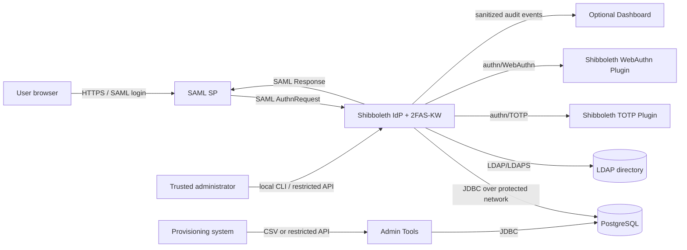

# 2FAS-KW Threat Model

- **Status:** Public draft
- **Scope:** 2FAS-KW for Shibboleth IdP v1.3.5
- **Review period:** 2026/08
- **Independent review:** Pending
- **Audience:** Maintainers, deployers, reviewers, and security researchers

This document describes security boundaries and threat scenarios for 2FAS-KW. It is
an engineering threat model, not a vulnerability assessment, penetration-test report,
or guarantee that the software is free of vulnerabilities.

## 1. Overview

### 1.1 Intended use

2FAS-KW extends Shibboleth IdP with a second-factor selection layer and a native
GraphicalMatrix authentication flow. A user first completes the IdP password flow.
The MFA decision strategy then applies an SP/network policy and selects one of:

- GraphicalMatrix through the Shibboleth `authn/External` flow;
- the Shibboleth TOTP plugin through `authn/TOTP`; or
- the Shibboleth WebAuthn plugin through `authn/WebAuthn`.

The runtime stores enrollment state in PostgreSQL or LDAP. Optional administrative
surfaces include the management API, SP management CLI, standalone Admin Tools and
CSV provisioning, and the audit Dashboard. These optional surfaces are not required
for ordinary authentication.

### 1.2 Component map

| Component | Security responsibility | Source evidence |
| --- | --- | --- |
| Shibboleth IdP | Primary authentication, SAML protocol processing, session and profile orchestration | `web.xml:14-51` |
| MFA decision strategy | Applies the SP/network MFA policy and selects the user's configured second-factor flow | `src/main/java/io/github/yasakawa/faskw/GraphicalMatrixMfaDecisionStrategy.java:47-118` |
| GraphicalMatrix web flow | Creates challenges, validates session-bound submissions, and returns an External Authentication result | `src/main/java/io/github/yasakawa/faskw/GraphicalMatrixStartServlet.java:46-134`; `src/main/java/io/github/yasakawa/faskw/GraphicalMatrixVerifyServlet.java:42-106` |
| Enrollment repository | Reads and updates enrollment, lockout, sequence, TOTP, and MFA method state | `src/main/java/io/github/yasakawa/faskw/GraphicalMatrixRepository.java:491-571`; `postgresql-schema.sql:1-16` |
| Sequence/TOTP protection | Protects GraphicalMatrix verifiers and recoverable TOTP seeds using separately configured storage modes | `src/main/java/io/github/yasakawa/faskw/GraphicalMatrixSequenceStorage.java:79-140`; `src/main/java/io/github/yasakawa/faskw/GraphicalMatrixTotpSeedStorage.java:76-140` |
| Self-service profile | Requires a current forced Password plus MFA result before changing enrollment | `src/main/java/io/github/yasakawa/faskw/GraphicalMatrixSelfServiceAuthentication.java:47-97` |
| Management API | Provides optional enrollment administration with enablement, CIDR, bearer-token, rate-limit, and protected-storage checks | `src/main/java/io/github/yasakawa/faskw/GraphicalMatrixAdminApiServlet.java:138-173` |
| SP management CLI | Validates and installs SP metadata, attribute release, access, and MFA policy state | `src/main/java/io/github/yasakawa/faskw/GraphicalMatrixSpMetadata.java:67-186` |
| Admin Tools | Performs privileged DB and CSV provisioning outside the IdP web process | `scripts/graphicalmatrix-admin-install.sh:83-150`; `scripts/graphicalmatrix-csv-import-runner.sh:63-115` |
| TOTP/WebAuthn plugins | Perform their respective authentication ceremonies; 2FAS-KW supplies routing and integration state | `totp-authn-config.xml:14-16`; `webauthn.properties:31-48` |
| Release tooling | Packages, checksums, signs, and verifies release artifacts | `scripts/build-plugin-package.sh:609-704` |

### 1.3 Deployment and trust zones

The primary security boundary is the IdP. The SP, browser, network, database, LDAP
directory, provisioning host, and Dashboard are separate trust zones even when a test
deployment runs more than one component on the same machine.

### 1.4 Important data flows

1. The browser starts SAML login at an SP and is redirected to Shibboleth IdP.
2. Shibboleth completes password authentication and provides the canonical username.
3. The MFA strategy evaluates SP and network policy and reads the user's MFA method.
4. For GraphicalMatrix, the plugin creates random display order, challenge ID and CSRF
   token, stores them in the HTTP session, and renders the challenge.
5. The browser submits selected image IDs. The server validates the flow key,
   challenge, CSRF token, expiry, one-time state, selected count, duplicate policy and
   displayed-image membership before comparing the credential.
6. Success or failure updates enrollment and lockout state and produces an audit event.
7. Shibboleth resumes the authentication profile and issues the SAML response under
   its relying-party and attribute-release configuration.

The challenge binding and one-time checks are implemented in
`GraphicalMatrixStartServlet.java:118-134` and
`GraphicalMatrixVerifyServlet.java:62-103`. Server-side selection and lockout updates
are implemented in `GraphicalMatrixRepository.java:491-571`.

### 1.5 Effective resources and security-sensitive configuration

| Deployment or workflow | Resource or capability | Configuration and precedence | Safe effective value or location | Readers, writers, or recipients | Enforcing control | Evidence or unknowns |
| --- | --- | --- | --- | --- | --- | --- |
| IdP runtime | Enrollment database credential | `DB_PROPERTIES` environment override, otherwise `conf/graphicalmatrix/db.properties` | Password referenced by a runtime-readable credential file; protected JDBC connection | IdP runtime and explicitly authorized Admin Tools | OS permissions, DB role, network/TLS controls | `GraphicalMatrixDbConfig.java:58-92,150-165`; transport security is deployment-owned |
| GraphicalMatrix hash storage | Sequence pepper | `graphicalmatrix.sequence.pepperFile` or direct property | File readable only by authorized runtime/admin processes | Sequence storage implementation | OS permissions plus HMAC verification | `GraphicalMatrixSequenceStorage.java:79-109,121-140,227-255` |
| TOTP enrollment | Recoverable TOTP seed key | `graphicalmatrix.totp.seed.storage` and matching key file | `aes-gcm` or `keyword` key held outside DB | IdP runtime and authorized recovery/admin workflow | AES-GCM/PBKDF2 implementation and production-mode validation | `GraphicalMatrixTotpSeedStorage.java:76-140,209-228` |
| Browser authentication | Session and challenge state | Servlet container session configuration and `graphicalmatrix.challenge.seconds` | Secure, HttpOnly, SameSite session cookie; short-lived one-time challenge | Browser and IdP runtime | Session cookie configuration, CSRF/flow key/expiry/used checks | `web.xml:113-127`; `GraphicalMatrixVerifyServlet.java:62-103` |
| Management API | Enrollment read/write authority | `conf/graphicalmatrix/api.properties` | Disabled unless required; restricted CIDRs and protected bearer-token file | Trusted provisioning client and IdP runtime | Enable flag, source CIDR, bearer token, failure rate limit | `GraphicalMatrixApiConfig.java:55-81`; `GraphicalMatrixAdminApiServlet.java:138-173`; release packaging forces disabled at `scripts/build-plugin-package.sh:328-335` |
| WebAuthn | Credential repository | Shibboleth WebAuthn Plugin `StorageService` configuration | Shared protected StorageService for clustered deployments | WebAuthn plugin and IdP | Plugin origin/RP ID and credential validation | `webauthn.properties:3-48`; effective production StorageService is deployment-specific |
| SP onboarding | Managed metadata and registry | `sp-management.properties` plus CLI-approved input | Root/runtime-group controlled metadata and registry files | SP management administrator and IdP metadata service | Non-symlink checks, size/parser limits, entityID and ACS host checks, digest approval | `GraphicalMatrixSpMetadata.java:67-186,189-220` |
| CSV provisioning | Enrollment mutation | `admin.properties`, incoming/processing/processed/failed directories | Dedicated restricted directories; auto-apply disabled until approved | Provisioning producer and Admin Tools runner | Enable flags, host/group checks, snapshot, filename, row/disable limits, lock | `scripts/graphicalmatrix-csv-import-runner.sh:63-115,172-224,227-249` |
| Release publication | Artifact signing authority | Release fingerprint and maintainer GnuPG keyring | Private signing key outside repository; public key and fingerprint in repository | Release maintainer and package consumers | Checksums, detached signatures, fingerprint verification | `scripts/build-plugin-package.sh:609-704` |

## 2. Threat Model, Trust Boundaries, and Assumptions

### 2.1 Protected assets

- User identity and the binding between the password-authenticated principal and MFA
  enrollment.
- GraphicalMatrix credential verifiers, sequence pepper, recoverable sequence keys,
  and forced-change state.
- TOTP seeds and their encryption keys.
- WebAuthn credentials, RP ID/origin binding, signature counters, and credential-owner
  binding managed by the Shibboleth WebAuthn Plugin.
- Enrollment status, selected MFA method, failed count, lockout state and state version.
- HTTP session, External Authentication flow key, challenge ID and CSRF token.
- SAML assertions, released attributes, IdP signing keys, SP metadata and relying-party
  policy integrity.
- DB passwords, LDAP bind credentials, management API bearer tokens and release
  signing keys.
- Administrative audit records and the integrity of provisioning input.
- Availability of the login path, database, LDAP directory and second-factor plugins.

### 2.2 Actors and starting capabilities

| Actor | Starting capabilities | Capabilities not assumed |
| --- | --- | --- |
| Unauthenticated Internet client | Sends HTTP requests and controls ordinary request parameters, headers and timing | No valid password, MFA secret, session cookie, API token, DB credential or trusted administrator access |
| Authenticated user | Controls their browser and valid first-factor credentials; may possess their own registered second factor | Cannot alter another user's enrollment or IdP policy |
| Registered or malicious SP | Sends SAML requests and controls its own endpoints and metadata submitted for onboarding | Cannot edit IdP metadata/configuration or sign as the IdP |
| Network attacker | Observes or modifies traffic on an unprotected segment | Does not possess valid endpoint TLS keys or already control a trusted reverse proxy |
| Provisioning client | Supplies CSV/API operations when explicitly authorized | Does not automatically receive shell, IdP configuration or release-signing authority |
| IdP/DB administrator | Has intentionally privileged operational access | Considered trusted for authorized administration; mistakes and credential compromise remain in scope |
| Supply-chain attacker | Attempts to replace source dependencies or release artifacts | Does not initially possess the maintainer signing key or protected GitHub authority |

### 2.3 Trust boundaries

| Boundary | Data or authority crossing | Required invariant | Existing control |
| --- | --- | --- | --- |
| Browser to IdP | Password-flow result, session cookie, challenge tokens and selected image IDs | The result remains bound to the same current user, flow and one-time challenge | Shibboleth External Authentication key, session-bound state, CSRF token, expiry and used flag |
| IdP to DB/LDAP | Enrollment, verifier, TOTP seed, lockout and MFA method | Only authorized processes can read or mutate state; transport does not expose secrets | DB/LDAP authentication, deployment network controls, storage encryption/reference modes |
| IdP to SP | Signed assertion and released attributes | Response is issued only after applicable authentication and only to the intended relying party | Shibboleth relying-party, metadata and attribute-filter processing |
| IdP to TOTP/WebAuthn plugins | Canonical user identity and factor flow state | Plugin result belongs to the password-authenticated user and intended IdP origin | MFA flow selection; WebAuthn second-factor previous-factor configuration |
| Management client to API | Enrollment administration authority | Disabled by default and callable only by explicitly trusted clients | Release-time disable, CIDR allowlist, bearer token, rate limiting and audit |
| Provisioning source to Admin Tools | Bulk add, modify and disable operations | Input is complete, bounded, attributable and not applied accidentally | Restricted directories, snapshot/rename, dry-run, action and row limits, process lock |
| Administrator to SP management | Metadata and policy changes | Exact SP identity, ACS host and reviewed content remain bound through apply | Dry-run/apply workflow, allowlists, parser limits and SHA-256 confirmation |
| Maintainer to release consumer | Executable plugin/Admin Tools/Dashboard artifacts | Consumer receives the reviewed artifact without substitution | Signed checksums, detached signatures and published fingerprint |

### 2.4 Security objectives and invariants

1. A second-factor result must not be accepted for a different principal, SP flow,
   browser session or expired/replayed challenge.
2. Browser-side restrictions are usability controls; all credential shape and
   membership checks must occur on the server.
3. GraphicalMatrix authentication failures and lockout updates must be atomic for the
   same enrollment.
4. GraphicalMatrix `hash` storage must not require recovery of the original sequence.
5. TOTP seed storage must remain recoverable for verification but encrypted in
   production; `hash` is not a valid TOTP seed storage mode.
6. An unavailable or invalid MFA policy must not silently bypass MFA. The current
   strategy falls back to requiring GraphicalMatrix when policy or method resolution
   fails (`GraphicalMatrixMfaDecisionStrategy.java:58-64,74-88,116-118`).
7. Administrative surfaces must be disabled until explicitly configured and must not
   rely on a single public-network control.
8. SP metadata must not introduce an unapproved ACS host, unsafe URL, XML entity
   expansion or uncontrolled metadata fetch.
9. Logs and API responses must not expose sequence material, TOTP seeds, bearer tokens,
   DB passwords or private keys.
10. Release consumers must be able to verify artifact integrity independently of the
    download channel.

### 2.5 Deployment assumptions

- External browser and SAML traffic uses correctly configured HTTPS. TLS termination,
  certificate lifecycle and proxy header rewriting are deployment responsibilities.
- PostgreSQL and LDAP traffic crosses only a protected network or uses verified TLS.
- `graphicalmatrix.mfa.useForwardedFor` remains `false` unless every request passes
  through a trusted proxy that overwrites forwarded client-IP headers
  (`mfa-policy.properties:46-50`).
- Production sets `graphicalmatrix.productionMode=true`, uses protected sequence/TOTP
  storage, and protects referenced key/credential files with OS permissions.
- The IdP administrator reviews and merges `.idpnew` configuration instead of blindly
  replacing established production configuration.
- TOTP and WebAuthn protocol correctness, authenticator behavior and credential-store
  implementation are primarily owned by their corresponding Shibboleth plugins.
- A host or browser already fully controlled by an attacker can expose that actor's
  current session and input; endpoint compromise is not prevented by this plugin.
- Administrators with direct database, IdP configuration or signing-key access are
  trusted for intended operations. Least privilege, separation of duties and key
  custody remain operational requirements.

### 2.6 Exclusions and open questions

- This model does not claim full coverage of Shibboleth IdP, Jetty, PostgreSQL, LDAP,
  browsers, authenticators or third-party plugin internals.
- Cluster-wide behavior depends on shared session, lockout and WebAuthn StorageService
  configuration. Each production topology must verify effective shared state.
- Capacity limits and denial-of-service thresholds depend on deployment size, DB pool,
  reverse proxy and IdP tuning; they require environment-specific load testing.
- Attribute correctness and authorization semantics depend on the institution's LDAP,
  Attribute Resolver, Attribute Filter and SP access policies.
- Detailed vulnerability findings and unpatched exploit instructions are managed
  through the process in the repository root `SECURITY.md`, not this public model.

## 3. Attack Surface, Mitigations, and Attacker Stories

The following entries are threat hypotheses and review targets. They are not, by
themselves, confirmed vulnerabilities.

| Priority | Scenario and capability gain | Prerequisites | Impact | Existing controls | Mitigation or verification | Evidence |
| --- | --- | --- | --- | --- | --- | --- |
| P1 | Steal, replay or cross-bind a GraphicalMatrix challenge to obtain another authentication result | Access to a victim request/session or a binding defect | MFA bypass and account impersonation | Flow key, user, challenge ID, CSRF token, expiry, display order and used flag are session-bound | Keep secure cookies and HTTPS; test replay, cross-session and expired submissions on each flow change | `GraphicalMatrixStartServlet.java:118-134`; `GraphicalMatrixVerifyServlet.java:62-103`; `web.xml:113-127` |
| P1 | Recover or replace enrollment secrets after DB/configuration compromise | Read/write access to DB, key files or IdP runtime account | Offline guessing, TOTP generation, enrollment substitution or broad account compromise | Hash+salt+pepper for GraphicalMatrix; AES-GCM/keyword options for recoverable values; DB role and file controls | Separate DB and key custody, rotate exposed secrets using documented migration, monitor state changes and backups | `GraphicalMatrixSequenceStorage.java:121-140,227-255`; `GraphicalMatrixTotpSeedStorage.java:120-140`; `postgresql-schema.sql:1-16` |
| P1 | Invoke the management API to add, change or disable MFA enrollment | API enabled and reachable; stolen token, overly broad CIDR, or authorization defect | Bulk enrollment takeover or denial of authentication | Release package disables API; CIDR, bearer, rate limit, protected-storage and audit checks | Keep disabled when unused; use HTTPS, edge restriction, dedicated token and rotation; test effective source-IP handling | `GraphicalMatrixAdminApiServlet.java:138-173`; `GraphicalMatrixApiConfig.java:55-81,92-125`; `scripts/build-plugin-package.sh:328-335` |
| P1 | Capture a self-service password on an unencrypted LDAP connection | Legacy LDAP login enabled and `ldap://` configured on an observable network | Disclosure of primary password | Legacy flow can be disabled; native self-service requires current forced Password plus MFA | Use native self-service and set `graphicalmatrix.change.legacyLdapLoginEnabled=false`; if retained, require validated LDAPS | `graphicalmatrix.properties:53-58`; `GraphicalMatrixLdapAuthenticator.java:125-146`; `GraphicalMatrixSelfServiceAuthentication.java:47-97` |
| P1 | Supply malicious or incorrect SP metadata to redirect assertions or trigger unsafe parsing/fetching | SP onboarding authority accepts unreviewed metadata | Assertion disclosure, SSRF, parser abuse or relying-party misbinding | Non-symlink and size checks, no redirects, DNS pinning, secure XML parser, expected entityID, HTTPS ACS and host allowlist | Preserve out-of-band digest review and least-privilege CLI access; test DNS rebinding and parser limits | `GraphicalMatrixSpMetadata.java:67-114,137-186,189-220` |
| P1 | Tamper with a release artifact or build output | Compromised download channel, CI or maintainer workflow | Execution of attacker code in the IdP or admin environment | Checksums, detached signatures, fingerprint verification and archive-content checks | Protect signing key separately, require branch review, verify from a clean keyring and publish fingerprint independently | `scripts/build-plugin-package.sh:609-704`; `docs/SIGNED-PLUGIN-PACKAGE.md` |
| P2 | Guess GraphicalMatrix sequences online | Valid password or an active first-factor session plus repeated attempts | Account compromise after first-factor compromise | Random display, server-side shape/membership checks, persistent failed count and timed lockout | Monitor lockouts, tune policy to deployment risk, add edge rate limiting without creating broad NAT lockout | `GraphicalMatrixRepository.java:491-571`; `graphicalmatrix.properties:21-28` |
| P2 | Use forged forwarded headers to reach a network MFA bypass rule | `useForwardedFor=true` while clients can bypass or influence the proxy | MFA policy bypass | Default uses `request.getRemoteAddr()` | Enable forwarded headers only behind a proxy that overwrites them; test direct-origin reachability | `GraphicalMatrixMfaDecisionStrategy.java:171-188`; `mfa-policy.properties:46-50` |
| P2 | Inject script, frame the login UI or expose sensitive responses through caching | Custom template/asset change, missing filter mapping or weak edge headers | Credential capture, UI redress or session-data disclosure | CSP, `frame-ancestors`, X-Frame-Options, no-store, nosniff and Referrer-Policy filter; secure cookie settings | Keep CSP enforce mode, retain filter mappings, avoid inline/untrusted content and verify deployed headers | `GraphicalMatrixSecurityHeadersFilter.java:30-121`; `scripts/graphicalmatrix-plugin-webxml.sh:85-104`; `web.xml:113-127` |
| P2 | Submit a partial, replaced or destructive CSV to Admin Tools | Write access to incoming directory or compromised provisioning producer | Bulk unauthorized enrollment change or disablement | Enable/group/host checks, regular-file snapshot, digest log, row and disable limits, dry-run, process lock | Use a dedicated upload identity and atomic rename, keep auto-apply off unless required, reconcile processed results | `scripts/graphicalmatrix-csv-import-runner.sh:63-115,172-249`; `admin.properties:15-27` |
| P2 | Exhaust IdP, DB or LDAP resources using authentication or administrative requests | Reachable service and insufficient upstream/runtime limits | Authentication outage | DB pooling/timeouts, challenge expiry, API auth throttling and bounded CSV/metadata input | Apply reverse-proxy rate limits, tune pools/timeouts, monitor dependency health and load-test expected peaks | `GraphicalMatrixDbConfig.java:72-92`; `GraphicalMatrixConfig.java:800-807`; `GraphicalMatrixApiConfig.java:70-81` |
| P2 | Route a user to the wrong MFA method or accept stale self-service authentication | Corrupted enrollment, principal canonicalization mismatch or flow integration error | Authentication failure or factor-policy bypass | Password principal is read from active MFA results; self-service rejects previous results and requires current Password plus second factor | Test canonical usernames across Password/TOTP/WebAuthn and fail closed on missing or unsupported state | `GraphicalMatrixMfaDecisionStrategy.java:74-135`; `GraphicalMatrixSelfServiceAuthentication.java:47-97` |
| P3 | Expose sensitive identifiers or operational detail through audit/Dashboard access | Excessive logging or unauthorized log/Dashboard access | Privacy loss and attacker reconnaissance | Separate audit paths and documented sanitization/normalization boundary | Restrict readers, rotate logs, verify that secrets and raw credentials never enter events, define retention | `src/main/java/io/github/yasakawa/faskw/GraphicalMatrixAuditLogger.java`; `docs/LOG-REFERENCE.md` |

## 4. Severity Calibration

Severity depends on demonstrated reachability, affected authority, deployment
prerequisites and existing controls. A threat hypothesis is not assigned a security
severity until those facts are validated.

### Critical

Examples:

- unauthenticated remote code execution in the IdP process;
- compromise of the release-signing path that produces apparently valid malicious
  artifacts for all consumers;
- systematic authentication bypass affecting arbitrary users without their first
  factor.

An issue is not Critical merely because it occurs in authentication code. A required
trusted administrator or prior host compromise generally reduces the new capability.

### High

Examples:

- remote bypass of GraphicalMatrix/TOTP/WebAuthn for arbitrary accounts after an
  ordinary first-factor step;
- unauthenticated administrative API access that can replace enrollment;
- broad disclosure of recoverable TOTP seeds or primary passwords;
- malicious SP metadata causing assertions for other users to be sent to an
  attacker-controlled endpoint under realistic onboarding conditions.

If exploitation requires an optional feature that is disabled in the release package,
severity must account for that prerequisite rather than treating it as always exposed.

### Medium

Examples:

- cross-site or framing weaknesses requiring significant user interaction;
- authenticated modification of another user's enrollment with limited reach;
- practical denial of service against an IdP node or a bounded population;
- sensitive audit-data disclosure without reusable authentication secrets.

Strong network allowlists, short-lived session state, rate limits or a required local
operator can materially reduce likelihood, but do not erase demonstrated impact.

### Low

Examples:

- limited information disclosure without credentials or meaningful account impact;
- missing defense-in-depth headers where script injection or framing is otherwise not
  achievable;
- an operational hardening gap that requires already privileged local access and adds
  little authority.

Documentation mismatch alone is not a vulnerability. It becomes security-relevant
when it predictably causes an unsafe effective configuration.

## Maintenance

Update this threat model in the same pull request when changing:

- authentication flow selection or principal canonicalization;
- session, challenge, CSRF or replay controls;
- GraphicalMatrix credential semantics or storage;
- TOTP/WebAuthn integration or registration hooks;
- self-service authorization;
- management API, Admin Tools, provisioning or Dashboard boundaries;
- SP metadata, attribute release, access policy or MFA policy management;
- release signing, dependency packaging or verification;
- supported deployment topology or security defaults.

Use the PR template's `Security impact` and `PATENT-REVIEW impact` fields to link the
change to this model and the design-provenance records.
